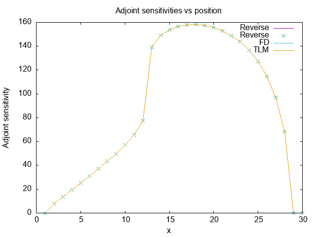

.. _tutorial_tapenade:

Tutorial 2 : Using Tapenade for a mountain glacier model 
********************************************************

In this tutorial, we will describe the steps to use Tapenade to develop the tangent linear and adjoint codes for a simple PDE-based mountain glacier model. The model itself is inspired from the book Fundamentals of Glacier Dynamics, by CJ van der Veen and has been used for glaciology summer schools before, for example `here <http://websrv.cs.umt.edu/isis/index.php/Adjoint_models>`__ , although they used a different tool to develop the adjoint model. 

As prerequisites, ensure you have Tapenade installed and gfortran compiler available.

.. _mountain_glacier_model:

Mountain glacier model
======================

Model description
-----------------

The equations for a simple, 1D mountain glacier are described here. 

.. math::
   \frac{\partial{H}}{\partial{t}} = -\frac{\partial}{\partial x}\left(-D(x)\frac{\partial{h}}{\partial{x}}\right) + M

where 

.. math::
   D(x) = CH^{n+2}\left|\frac{\partial h}{\partial x}\right|^{n-1}

and

.. math::
   C = \frac{2A}{n+2}(\rho g)^n

Here :math:`H(x,t)` is the thickness of the ice sheet, :math:`h(x,t)` is the height of the top surface of the ice sheet (taken from some reference height), :math:`b(x)` is the height of the base of the ice sheet (taken from the same reference height). These three parameters can be related as 

.. math::
   H(x,t) = h(x,t) - b(x)

In essence it's a highly non-linear diffusion equation with a source term. Furthermore, the boundary conditions are given by

.. math::
   H_{\rm left} = 0

and

.. math::
   H_{\rm right} = 0

Model parameters
----------------

We assume that the basal topography is linear in :math:`x` such that :math:`\frac{\partial{b}}{\partial{x}} = -0.1`. :math:`M` is the accumulation rate and is modeled to be constant in time, but varying linearly in space. 

.. math::
   M(x) = M_0 - x M_1

where :math:`M_0 = 4.0 \:{\rm m/yr}, \:M_1 = 0.0002 \:{\rm yr}^{-1}`.

The acceleration due to gravity :math:`g = 9.2 \:{\rm m/s}^2`. The density of ice :math:`\rho = 920 \:{\rm kg/m}^3`. The exponent :math:`n = 3` comes from Glen's flow law. We take :math:`A = 10^{-16} \: {\rm Pa}^{-3} {\rm a}^{-1}`. Our domain length is :math:`L = 30 \:{\rm km}`. The total time we run the simulation for is :math:`T = 5000 \:{\rm years}`.

Discretization and Finite Volumes solution
------------------------------------------

The equations above cannot be solved analytically. Here we discuss a Finite Volumes method to solve them. We use a staggered grid such that :math:`D` is computed at the centres of the grid, and :math:`H, h` are computed at the vertices. 

.. math::
   D\left(x_{j+1/2}\right) = C\left(\frac{H_j + H_{j+1}}{2}\right)^{n+2}\left(\frac{h_{j+1}-h_j}{\Delta x}\right)^{n-1}
    
.. math::
   \phi_{j+1/2} = D\left(x_{j+1/2}\right)\frac{\partial{h}}{\partial{x}}, \:\text{where}\: \frac{\partial h}{\partial x} = \frac{h_{j+1}-h_j}{\Delta x}

.. math::
   \frac{\partial H_j}{\partial t} = - \frac{\phi_{j+1/2}-\phi_{j-1/2}}{\Delta x} + M(x_j)

Here, :math:`\phi` indicates flux and is just an intermediate variable. 

We step forward in time using the simple Euler forward scheme. Here we choose :math:`\Delta x = 1.0\:{\rm km}, \Delta t = 1.0\:{\rm month} = \frac{1}{12}\:{\rm years}`. 

What sensitivities are we interested in?
----------------------------------------

Our Quantity of Interest (QoI) is the total volume of the ice sheet after 5000 years (defined as ``V`` in the code). The control variables are the spatially varying accumulation rate. We are interested in the sensitivities of the QoI to the perturbations in the accumulation rate at various locations along the ice sheet. (defined as ``xx`` in the code)

.. _t2_forward_model:

Forward Model code
==================

The code for the non-linear forward model is given here.

``forward.f90``

.. code-block:: fortran

   module forward

   implicit none
	real(8), parameter :: xend = 30
	real(8), parameter :: dx = 1
	integer, parameter :: nx = int(xend/dx)

   contains

	subroutine forward_problem(xx,V)

		implicit none

		real(8), parameter :: rho = 920.0
		real(8), parameter :: g = 9.2
		real(8), parameter :: n = 3
		real(8), parameter :: A = 1e-16
		real(8), parameter :: dt = 1/12.0
		real(8), parameter :: C = 2*A/(n+2)*(rho*g)**n*(1.e3)**n
		real(8), parameter :: tend = 5000
		real(8), parameter :: bx = -0.0001
		real(8), parameter :: M0 = .004, M1 = 0.0002
		integer, parameter :: nt = int(tend/dt)
		real(8), dimension(nx+1,nt+1) :: h
		real(8), dimension(nx+1,nt+1) :: h_capital
		integer :: t,i
		real(8), dimension(nx+1) :: xarr 
		real(8), dimension(nx+1) :: M 
		real(8), dimension(nx+1) :: b 
		real(8), dimension(nx) :: D, phi
		real(8), intent(in), dimension(nx+1) :: xx
		real(8), intent(out) :: V

		xarr = (/ ((i-1)*dx, i=1,nx+1) /)
		M = (/ (M0-(i-1)*dx*M1, i=1,nx+1) /)
		b = (/ (1.0+bx*(i-1)*dx, i=1,nx+1) /)
		M = M + xx
		h(1,:) = b(1)
		h(:,1) = b
		h(nx+1,:) = b(nx+1)
		h_capital(1,:) = h(1,:) - b(1)
		h_capital(nx+1,:) = h(nx+1,:) - b(nx+1)
		h_capital(:,1) = h(:,1) - b

		do t = 1,nt
			D(:) = C * ((h_capital(1:nx,t)+h_capital(2:nx+1,t))/2)**(n+2) * ((h(2:nx+1,t) - h(1:nx,t))/dx)**(n-1)
			phi(:) = -D(:)*(h(2:nx+1,t)-h(1:nx,t))/dx
			h(2:nx,t+1) = h(2:nx,t) + M(2:nx)*dt - dt/dx * (phi(2:nx)-phi(1:nx-1))

			where (h(:,t+1) < b)
				h(:,t+1) = b
			end where 

			h_capital(:,t+1) = h(:,t+1) - b

		end do

		V = 0.

		open (unit = 2, file = "results_forward_run.txt", action="write",status="replace")
	        write(2,*) "         #                H                h                  b"
	        write(2,*) "_______________________________________________________________________________"

		do i = 1, size(h_capital(:,nt+1))
      	   	     V = V + h_capital(i,nt+1)*dx

		     write(2,*) i, "    ", h_capital(i,nt+1), "    ", h(i,nt+1), "    ", b(i)
       		end do

 
	close(2)
	end subroutine forward_problem

   end module forward

.. _t2_FD:

Finite Differences for validation
=================================

We can use finite differences with the forward differencing scheme (or alternatively, a more accurate central differencing scheme mentioned in :doc:`Tutorial 1 <tutorial_self_ad>` ). to get the gradient evaluated at the given value of the control vector :math:`\mathbf{x}`. For a :math:`N` dimensional control vector, the forward model needs to be called :math:`N+1` times in the forward differencing scheme to get an approximate gradient. This is because we can only evaluate directional derivatives, which we need to do :math:`N` times to get the gradient. Each directional derivative evaluation, in turn, requires 1 perturbed forward model evaluation and 1 unperturbed forward model evaluation (this can be done only once and stored).

Mathematically, this can be formulated as (:math:`\mathcal{J}` is the objective function, in our case the total volume denoted by ``V`` in the code)

.. math::
   \left (\nabla_{\mathbf{x}} \mathcal{J}(\mathbf{x}), \hat{\mathbf{e}} \right) \approx \frac{\mathcal{J}\left(\mathbf{x}+\epsilon \hat{\mathbf{e}}\right) - \mathcal{J}\left(\mathbf{x}\right)}{\epsilon} + \mathcal{O}(\epsilon)

Here :math:`(.,.)` indicates the normal inner product of two discrete vectors in :math:`\mathbb{R}^N`.

The left side is the directional derivative of :math:`\mathcal{J}` at :math:`\mathbf{x}` in the direction :math:`\hat{\mathbf{e}}`, while the right side is the finite differences approximation of the directional derivative.

The choice of :math:`\epsilon` can be critical, however we do not discuss that here and simply choose a value :math:`\epsilon = 1.e-7`. In general, one would perform a convergence analysis with a range of values of :math:`\epsilon = {0.1, 0.01, 0.001, ...}`.

The code for the finite differences can be found in the :ref:`t2_Driver`.

.. _t2_TLM:

Tangent Linear model
====================

The tangent linear model is described in detail in :doc:`Tutorial 1 <tutorial_self_ad>`. Another excellent resource is the `MITgcm documentation <https://mitgcm.readthedocs.io/en/latest/autodiff/autodiff.html#some-basic-algebra>`__.

Generating Tangent Linear model code using Tapenade
---------------------------------------------------

It is pretty simple to generate the tangent linear model for our forward model.

::

    % tapenade -tangent -tgtmodulename %_tgt -head "forward_problem(V)/(xx)" forward.f90

``-tangent`` tells Tapenade that we want a tangent linear code.

``-tgtmodulename %_tgt`` tells Tapenade to suffix the differentiated modules with ``_tgt``.

``-head "forward_problem(V)/(xx)`` tells Tapenade that the head subroutine is ``forward_problem``, the dependent variable or the objective function is ``V`` and the independent variable is ``xx``. 

This generates 2 files - 

* ``forward_d.f90`` - This file contains the tangent linear module (called ``forward_tgt``) as well as the original forward code module. ``forward_tgt``) contains the ``forward_problem_d`` subroutine which is our tangent linear model. All the differential variables are suffixed with the alphabet ``d``.

.. code-block:: fortran

  !        Generated by TAPENADE     (INRIA, Ecuador team)
  !  TAPENADE 3.15 (master) - 15 Apr 2020 13:12
  !
  MODULE FORWARD_TGT
    IMPLICIT NONE
    REAL*8, PARAMETER :: xend=30
    REAL*8, PARAMETER :: dx=1
    INTEGER, PARAMETER :: nx=INT(xend/dx)
  
  CONTAINS
  !  Differentiation of forward_problem in forward (tangent) mode:
  !   variations   of useful results: v
  !   with respect to varying inputs: xx
  !   RW status of diff variables: v:out xx:in
    SUBROUTINE FORWARD_PROBLEM_D(xx, xxd, v, vd)
      IMPLICIT NONE
      REAL*8, PARAMETER :: rho=920.0
      REAL*8, PARAMETER :: g=9.2
      REAL*8, PARAMETER :: n=3
      REAL*8, PARAMETER :: a=1e-16
      REAL*8, PARAMETER :: dt=1/12.0
      REAL*8, PARAMETER :: c=2*a/(n+2)*(rho*g)**n*1.e3**n
      REAL*8, PARAMETER :: tend=5000
      REAL*8, PARAMETER :: bx=-0.0001
      REAL*8, PARAMETER :: m0=.004, m1=0.0002
      INTRINSIC INT
      INTEGER, PARAMETER :: nt=INT(tend/dt)
      REAL*8, DIMENSION(nx+1, nt+1) :: h
      REAL*8, DIMENSION(nx+1, nt+1) :: hd
      REAL*8, DIMENSION(nx+1, nt+1) :: h_capital
      REAL*8, DIMENSION(nx+1, nt+1) :: h_capitald
      INTEGER :: t, i
      REAL*8, DIMENSION(nx+1) :: xarr
      REAL*8, DIMENSION(nx+1) :: m
      REAL*8, DIMENSION(nx+1) :: md
      REAL*8, DIMENSION(nx+1) :: b
      REAL*8, DIMENSION(nx) :: d, phi
      REAL*8, DIMENSION(nx) :: dd, phid
      REAL*8, DIMENSION(nx+1), INTENT(IN) :: xx
      REAL*8, DIMENSION(nx+1), INTENT(IN) :: xxd
      REAL*8, INTENT(OUT) :: v
      REAL*8, INTENT(OUT) :: vd
      INTRINSIC SIZE
      REAL*8, DIMENSION(nx) :: pwx1
      REAL*8, DIMENSION(nx) :: pwx1d
      REAL*8 :: pwy1
      REAL*8, DIMENSION(nx) :: pwr1
      REAL*8, DIMENSION(nx) :: pwr1d
      REAL*8, DIMENSION(nx) :: pwx2
      REAL*8, DIMENSION(nx) :: pwx2d
      REAL*8 :: pwy2
      REAL*8, DIMENSION(nx) :: pwr2
      REAL*8, DIMENSION(nx) :: pwr2d
      REAL*8, DIMENSION(nx) :: temp
      xarr = (/((i-1)*dx, i=1,nx+1)/)
      m = (/(m0-(i-1)*dx*m1, i=1,nx+1)/)
      b = (/(1.0+bx*(i-1)*dx, i=1,nx+1)/)
      md = xxd
      m = m + xx
      h(1, :) = b(1)
      h(:, 1) = b
      h(nx+1, :) = b(nx+1)
      h_capital(1, :) = h(1, :) - b(1)
      h_capital(nx+1, :) = h(nx+1, :) - b(nx+1)
      h_capital(:, 1) = h(:, 1) - b
      h_capitald = 0.0_8
      hd = 0.0_8
      DO t=1,nt
        pwx1d = (h_capitald(1:nx, t)+h_capitald(2:nx+1, t))/2
        pwx1 = (h_capital(1:nx, t)+h_capital(2:nx+1, t))/2
        pwy1 = n + 2
        WHERE (pwx1 .LE. 0.0 .AND. (pwy1 .EQ. 0.0 .OR. pwy1 .NE. INT(pwy1)&
  &         )) 
          pwr1d = 0.0_8
        ELSEWHERE
          pwr1d = pwy1*pwx1**(pwy1-1)*pwx1d
        END WHERE
        pwr1 = pwx1**pwy1
        pwx2d = (hd(2:nx+1, t)-hd(1:nx, t))/dx
        pwx2 = (h(2:nx+1, t)-h(1:nx, t))/dx
        pwy2 = n - 1
        WHERE (pwx2 .LE. 0.0 .AND. (pwy2 .EQ. 0.0 .OR. pwy2 .NE. INT(pwy2)&
  &         )) 
          pwr2d = 0.0_8
        ELSEWHERE
          pwr2d = pwy2*pwx2**(pwy2-1)*pwx2d
        END WHERE
        pwr2 = pwx2**pwy2
        dd(:) = c*(pwr2*pwr1d+pwr1*pwr2d)
        d(:) = c*pwr1*pwr2
        temp = h(2:nx+1, t) - h(1:nx, t)
        phid(:) = -(temp*dd(:)/dx+d(:)*(hd(2:nx+1, t)-hd(1:nx, t))/dx)
        phi(:) = -(d(:)/dx*temp)
        hd(2:nx, t+1) = hd(2:nx, t) + dt*md(2:nx) - dt*(phid(2:nx)-phid(1:&
  &       nx-1))/dx
        h(2:nx, t+1) = h(2:nx, t) + m(2:nx)*dt - dt/dx*(phi(2:nx)-phi(1:nx&
  &       -1))
        WHERE (h(:, t+1) .LT. b) 
          hd(:, t+1) = 0.0_8
          h(:, t+1) = b
        END WHERE
        h_capitald(:, t+1) = hd(:, t+1)
        h_capital(:, t+1) = h(:, t+1) - b
      END DO
      v = 0.
      OPEN(unit=2, file='results_forward_run.txt', action='write', status=&
  &  'replace') 
      WRITE(2, *) &
  &   '         #                H                h                  b'
      WRITE(2, *) '_______________________________________________________&
  &________________________'
      vd = 0.0_8
      DO i=1,SIZE(h_capital(:, nt+1))
        vd = vd + dx*h_capitald(i, nt+1)
        v = v + h_capital(i, nt+1)*dx
        WRITE(2, *) i, '    ', h_capital(i, nt+1), '    ', h(i, nt+1), &
  &     '    ', b(i)
      END DO
      CLOSE(2) 
    END SUBROUTINE FORWARD_PROBLEM_D
  
    SUBROUTINE FORWARD_PROBLEM(xx, v)
      IMPLICIT NONE
      REAL*8, PARAMETER :: rho=920.0
      REAL*8, PARAMETER :: g=9.2
      REAL*8, PARAMETER :: n=3
      REAL*8, PARAMETER :: a=1e-16
      REAL*8, PARAMETER :: dt=1/12.0
      REAL*8, PARAMETER :: c=2*a/(n+2)*(rho*g)**n*1.e3**n
      REAL*8, PARAMETER :: tend=5000
      REAL*8, PARAMETER :: bx=-0.0001
      REAL*8, PARAMETER :: m0=.004, m1=0.0002
      INTRINSIC INT
      INTEGER, PARAMETER :: nt=INT(tend/dt)
      REAL*8, DIMENSION(nx+1, nt+1) :: h
      REAL*8, DIMENSION(nx+1, nt+1) :: h_capital
      INTEGER :: t, i
      REAL*8, DIMENSION(nx+1) :: xarr
      REAL*8, DIMENSION(nx+1) :: m
      REAL*8, DIMENSION(nx+1) :: b
      REAL*8, DIMENSION(nx) :: d, phi
      REAL*8, DIMENSION(nx+1), INTENT(IN) :: xx
      REAL*8, INTENT(OUT) :: v
      INTRINSIC SIZE
      REAL*8, DIMENSION(nx) :: pwx1
      REAL*8 :: pwy1
      REAL*8, DIMENSION(nx) :: pwr1
      REAL*8, DIMENSION(nx) :: pwx2
      REAL*8 :: pwy2
      REAL*8, DIMENSION(nx) :: pwr2
      xarr = (/((i-1)*dx, i=1,nx+1)/)
      m = (/(m0-(i-1)*dx*m1, i=1,nx+1)/)
      b = (/(1.0+bx*(i-1)*dx, i=1,nx+1)/)
      m = m + xx
      h(1, :) = b(1)
      h(:, 1) = b
      h(nx+1, :) = b(nx+1)
      h_capital(1, :) = h(1, :) - b(1)
      h_capital(nx+1, :) = h(nx+1, :) - b(nx+1)
      h_capital(:, 1) = h(:, 1) - b
      DO t=1,nt
        pwx1 = (h_capital(1:nx, t)+h_capital(2:nx+1, t))/2
        pwy1 = n + 2
        pwr1 = pwx1**pwy1
        pwx2 = (h(2:nx+1, t)-h(1:nx, t))/dx
        pwy2 = n - 1
        pwr2 = pwx2**pwy2
        d(:) = c*pwr1*pwr2
        phi(:) = -(d(:)*(h(2:nx+1, t)-h(1:nx, t))/dx)
        h(2:nx, t+1) = h(2:nx, t) + m(2:nx)*dt - dt/dx*(phi(2:nx)-phi(1:nx&
  &       -1))
        WHERE (h(:, t+1) .LT. b) h(:, t+1) = b
        h_capital(:, t+1) = h(:, t+1) - b
      END DO
      v = 0.
      OPEN(unit=2, file='results_forward_run.txt', action='write', status=&
  &  'replace') 
      WRITE(2, *) &
  &   '         #                H                h                  b'
      WRITE(2, *) '_______________________________________________________&
  &________________________'
      DO i=1,SIZE(h_capital(:, nt+1))
        v = v + h_capital(i, nt+1)*dx
        WRITE(2, *) i, '    ', h_capital(i, nt+1), '    ', h(i, nt+1), &
  &     '    ', b(i)
      END DO
      CLOSE(2) 
    END SUBROUTINE FORWARD_PROBLEM
  
  END MODULE FORWARD_TGT

* ``forward_d.msg`` - Contains warning messages. TAPENADE can be quite verbose with the warnings. None of the warnings below are much important. 

.. code-block::
 
 1 Command: Procedure forward_problem understood as forward.forward_problem
 2 forward_problem: (AD03) Varied variable h[i,nt+1] written by I-O to file 2
 3 forward_problem: (AD03) Varied variable h_capital[i,nt+1] written by I-O to file 2
 ~             
 
.. _t2_Adjoint:

Adjoint Model
=============

The adjoint model is described in detail in :doc:`Tutorial 1 <tutorial_self_ad>`. Another excellent resource is the `MITgcm documentation <https://mitgcm.readthedocs.io/en/latest/autodiff/autodiff.html#some-basic-algebra>`__.

Generating Adjoint model code using Tapenade
--------------------------------------------

It is pretty simple to generate the tangent linear model for our forward model.

::

    % tapenade -reverse -head "forward_problem(V)/(xx)" forward.f90

``-reverse`` tells Tapenade that we want a reverse i.e. adjoint code.

``-head "forward_problem(V)/(xx)`` tells Tapenade that the head subroutine is ``forward_problem``, the dependent variable or the objective function is ``V`` and the independent variable is ``xx``.

This generates 2 files -

* ``forward_b.f90`` - This file contains the adjoint module (called ``forward_diff``) as well as the original forward code module. ``forward_diff`` contains the ``forward_problem_b`` subroutine which is our adjoint model. Notice how it requires values for ``xx, V`` which have to be obtained from a forward solve (calling the ``forward`` subroutine). We also will define ``Vb = 1`` and propagate the adjoint sensitivities backwards to evaluate ``xxb``. If you look at the second ``DO`` loop in ``forward_problem_b``, it indeed runs backwards in time. Note that all the adjoint variables in the code are simply suffixed with the alphabet ``b``. There are also a lot of ``PUSH`` and ``POP`` statements, they are essentially pushing and popping the stored variables from a stack just like we did manually in :doc:`Tutorial 1 <tutorial_self_ad>`.

.. code-block:: fortran

   !  TAPENADE 3.15 (master) - 15 Apr 2020 13:12
   !
   MODULE FORWARD_DIFF
     IMPLICIT NONE
     REAL*8, PARAMETER :: xend=30
     REAL*8, PARAMETER :: dx=1
     INTEGER, PARAMETER :: nx=INT(xend/dx)
   
   CONTAINS
   !  Differentiation of forward_problem in reverse (adjoint) mode:
   !   gradient     of useful results: v
   !   with respect to varying inputs: v xx
   !   RW status of diff variables: v:in-zero xx:out
     SUBROUTINE FORWARD_PROBLEM_B(xx, xxb, v, vb)
       IMPLICIT NONE
       REAL*8, PARAMETER :: rho=920.0
       REAL*8, PARAMETER :: g=9.2
       REAL*8, PARAMETER :: n=3
       REAL*8, PARAMETER :: a=1e-16
       REAL*8, PARAMETER :: dt=1/12.0
       REAL*8, PARAMETER :: c=2*a/(n+2)*(rho*g)**n*1.e3**n
       REAL*8, PARAMETER :: tend=5000
       REAL*8, PARAMETER :: bx=-0.0001
       REAL*8, PARAMETER :: m0=.004, m1=0.0002
       INTRINSIC INT
       INTEGER, PARAMETER :: nt=INT(tend/dt)
       REAL*8, DIMENSION(nx+1, nt+1) :: h
       REAL*8, DIMENSION(nx+1, nt+1) :: hb
       REAL*8, DIMENSION(nx+1, nt+1) :: h_capital
       REAL*8, DIMENSION(nx+1, nt+1) :: h_capitalb
       INTEGER :: t, i
       REAL*8, DIMENSION(nx+1) :: xarr
       REAL*8, DIMENSION(nx+1) :: m
       REAL*8, DIMENSION(nx+1) :: mb
       REAL*8, DIMENSION(nx+1) :: b
       REAL*8, DIMENSION(nx) :: d, phi
       REAL*8, DIMENSION(nx) :: db, phib
       REAL*8, DIMENSION(nx+1), INTENT(IN) :: xx
       REAL*8, DIMENSION(nx+1) :: xxb
       REAL*8 :: v
       REAL*8 :: vb
       INTRINSIC SIZE
       LOGICAL, DIMENSION(nx+1) :: mask
       REAL*8, DIMENSION(nx) :: temp
       REAL*8, DIMENSION(nx) :: temp0
       REAL*8, DIMENSION(nx) :: tempb
       REAL*8, DIMENSION(nx) :: tempb0
       REAL*8, DIMENSION(nx-1) :: tempb1
       INTEGER :: ad_to
       m = (/(m0-(i-1)*dx*m1, i=1,nx+1)/)
       b = (/(1.0+bx*(i-1)*dx, i=1,nx+1)/)
       m = m + xx
       h(1, :) = b(1)
       h(:, 1) = b
       h(nx+1, :) = b(nx+1)
       h_capital(1, :) = h(1, :) - b(1)
       h_capital(nx+1, :) = h(nx+1, :) - b(nx+1)
       h_capital(:, 1) = h(:, 1) - b
       DO t=1,nt
         CALL PUSHREAL8ARRAY(d, nx)
         d(:) = c*((h_capital(1:nx, t)+h_capital(2:nx+1, t))/2)**(n+2)*((h(&
   &       2:nx+1, t)-h(1:nx, t))/dx)**(n-1)
         phi(:) = -(d(:)*(h(2:nx+1, t)-h(1:nx, t))/dx)
         CALL PUSHREAL8ARRAY(h(2:nx, t+1), nx - 1)
         h(2:nx, t+1) = h(2:nx, t) + m(2:nx)*dt - dt/dx*(phi(2:nx)-phi(1:nx&
   &       -1))
         CALL PUSHBOOLEANARRAY(mask, nx + 1)
         mask(:) = h(:, t+1) .LT. b
         CALL PUSHREAL8ARRAY(h(:, t+1), nx + 1)
         WHERE (mask(:)) h(:, t+1) = b
         CALL PUSHREAL8ARRAY(h_capital(:, t+1), nx + 1)
         h_capital(:, t+1) = h(:, t+1) - b
       END DO
       DO i=1,SIZE(h_capital(:, nt+1))
   
       END DO
       CALL PUSHINTEGER4(i - 1)
       h_capitalb = 0.0_8
       CALL POPINTEGER4(ad_to)
       DO i=ad_to,1,-1
         h_capitalb(i, nt+1) = h_capitalb(i, nt+1) + dx*vb
       END DO
       hb = 0.0_8
       mb = 0.0_8
       DO t=nt,1,-1
         CALL POPREAL8ARRAY(h_capital(:, t+1), nx + 1)
         hb(:, t+1) = hb(:, t+1) + h_capitalb(:, t+1)
         h_capitalb(:, t+1) = 0.0_8
         CALL POPREAL8ARRAY(h(:, t+1), nx + 1)
         CALL POPBOOLEANARRAY(mask, nx + 1)
         phib = 0.0_8
         CALL POPREAL8ARRAY(h(2:nx, t+1), nx - 1)
         db = 0.0_8
         temp = (h(2:nx+1, t)-h(1:nx, t))/dx
         temp0 = (h_capital(1:nx, t)+h_capital(2:nx+1, t))/2
         WHERE (mask(:)) hb(:, t+1) = 0.0_8
         hb(2:nx, t) = hb(2:nx, t) + hb(2:nx, t+1)
         mb(2:nx) = mb(2:nx) + dt*hb(2:nx, t+1)
         tempb1 = -(dt*hb(2:nx, t+1)/dx)
         hb(2:nx, t+1) = 0.0_8
         phib(2:nx) = phib(2:nx) + tempb1
         phib(1:nx-1) = phib(1:nx-1) - tempb1
         db(:) = -((h(2:nx+1, t)-h(1:nx, t))*phib(:)/dx)
         tempb = -(d(:)*phib(:)/dx)
         hb(2:nx+1, t) = hb(2:nx+1, t) + tempb
         hb(1:nx, t) = hb(1:nx, t) - tempb
         CALL POPREAL8ARRAY(d, nx)
         WHERE (temp0 .LE. 0.0 .AND. (n + 2 .EQ. 0.0 .OR. n + 2 .NE. INT(n &
   &         + 2))) 
           tempb = 0.0_8
         ELSEWHERE
           tempb = (n+2)*temp0**(n+1)*temp**(n-1)*c*db(:)/2
         END WHERE
         WHERE (temp .LE. 0.0 .AND. (n - 1 .EQ. 0.0 .OR. n - 1 .NE. INT(n -&
   &         1))) 
           tempb0 = 0.0_8
         ELSEWHERE
           tempb0 = (n-1)*temp**(n-2)*temp0**(n+2)*c*db(:)/dx
         END WHERE
         hb(2:nx+1, t) = hb(2:nx+1, t) + tempb0
         hb(1:nx, t) = hb(1:nx, t) - tempb0
         h_capitalb(1:nx, t) = h_capitalb(1:nx, t) + tempb
         h_capitalb(2:nx+1, t) = h_capitalb(2:nx+1, t) + tempb
       END DO
       xxb = 0.0_8
       xxb = mb
       vb = 0.0_8
     END SUBROUTINE FORWARD_PROBLEM_B
   
     SUBROUTINE FORWARD_PROBLEM(xx, v)
       IMPLICIT NONE
       REAL*8, PARAMETER :: rho=920.0
       REAL*8, PARAMETER :: g=9.2
       REAL*8, PARAMETER :: n=3
       REAL*8, PARAMETER :: a=1e-16
       REAL*8, PARAMETER :: dt=1/12.0
       REAL*8, PARAMETER :: c=2*a/(n+2)*(rho*g)**n*1.e3**n
       REAL*8, PARAMETER :: tend=5000
       REAL*8, PARAMETER :: bx=-0.0001
       REAL*8, PARAMETER :: m0=.004, m1=0.0002
       INTRINSIC INT
       INTEGER, PARAMETER :: nt=INT(tend/dt)
       REAL*8, DIMENSION(nx+1, nt+1) :: h
       REAL*8, DIMENSION(nx+1, nt+1) :: h_capital
       INTEGER :: t, i
       REAL*8, DIMENSION(nx+1) :: xarr
       REAL*8, DIMENSION(nx+1) :: m
       REAL*8, DIMENSION(nx+1) :: b
       REAL*8, DIMENSION(nx) :: d, phi
       REAL*8, DIMENSION(nx+1), INTENT(IN) :: xx
       REAL*8, INTENT(OUT) :: v
       INTRINSIC SIZE
       LOGICAL, DIMENSION(nx+1) :: mask
       xarr = (/((i-1)*dx, i=1,nx+1)/)
       m = (/(m0-(i-1)*dx*m1, i=1,nx+1)/)
       b = (/(1.0+bx*(i-1)*dx, i=1,nx+1)/)
       m = m + xx
       h(1, :) = b(1)
       h(:, 1) = b
       h(nx+1, :) = b(nx+1)
       h_capital(1, :) = h(1, :) - b(1)
       h_capital(nx+1, :) = h(nx+1, :) - b(nx+1)
       h_capital(:, 1) = h(:, 1) - b
       DO t=1,nt
         d(:) = c*((h_capital(1:nx, t)+h_capital(2:nx+1, t))/2)**(n+2)*((h(&
   &       2:nx+1, t)-h(1:nx, t))/dx)**(n-1)
         phi(:) = -(d(:)*(h(2:nx+1, t)-h(1:nx, t))/dx)
         h(2:nx, t+1) = h(2:nx, t) + m(2:nx)*dt - dt/dx*(phi(2:nx)-phi(1:nx&
   &       -1))
         mask(:) = h(:, t+1) .LT. b
         WHERE (mask(:)) h(:, t+1) = b
         h_capital(:, t+1) = h(:, t+1) - b
       END DO
       v = 0.
       OPEN(unit=2, file='results_forward_run.txt', action='write', status=&
   &  'replace') 
       WRITE(2, *) &
   &   '         #                H                h                  b'
       WRITE(2, *) '_______________________________________________________&
   &________________________'
       DO i=1,SIZE(h_capital(:, nt+1))
         v = v + h_capital(i, nt+1)*dx
         WRITE(2, *) i, '    ', h_capital(i, nt+1), '    ', h(i, nt+1), &
   &     '    ', b(i)
       END DO
       CLOSE(2) 
     END SUBROUTINE FORWARD_PROBLEM
   
   END MODULE FORWARD_DIFF

* ``forward_b.msg`` - Contains warning messages. Tapenade can be quite verbose with the warnings. None of the warnings below are much important. 

.. code-block::

   1 Command: Procedure forward_problem understood as forward.forward_problem
   2 forward_problem: Command: Input variable(s) v have their derivative modified in forward_problem: added to independents
   3 forward_problem: (AD03) Varied variable h[i,nt+1] written by I-O to file 2
   4 forward_problem: (AD03) Varied variable h_capital[i,nt+1] written by I-O to file 2
   
.. _t2_Driver:

Driver Routine
==============

The driver routine evaluates the sensitivities of our cost function ``V`` to the independent variable ``xx`` in three ways - Finite Differences, Tangent Linear Model (forward mode), Adjoint Model (reverse mode). Both the TLM and adjoint methods should give sensitivities that agree within some tolerance with the Finite Differences sensitivities. One can see that the TLM and finite differences have to be called multiple times (as many times as the number of control variables) while the adjoint model only has to be called once to evaluate the entire gradient, making it much more efficient. 

.. code-block:: fortran

   program driver
   	!!Essentially both modules had variables with the same name
   	!!so they had to be locally aliased for the code to compile and run
   	!!Obviously only one set of variables is needed so the other is useless
   	
   	use forward_diff, n => nx, fp => forward_problem !! Alias to a local variable
   	use forward_tgt, n_useless => nx, fp_useless => forward_problem 
   
   	implicit none 
   
   	real(8), dimension(n+1) :: xx=0., xx_tlm =0., xxb =0., xx_fd, accuracy
   	real(8) :: V=0., Vb = 1., V_forward, Vd = 0.
   	real(8), parameter :: eps = 1.d-7
   	integer :: ii
   
   	call fp(xx,V)
   
   	!! Forward run
   	V_forward = V
   
   
   	!! Adjoint run
   	xx = 0.
   	V = 0.
   	call fp(xx,V)
   	call forward_problem_b(xx,xxb,V,Vb)
   
   
   	open (unit = 1, file = "results.txt", action="write",status="replace")
   
   	write(1,*) "         #                Reverse                           FD",&
   			"                          Tangent                     Relative accuracy"
   	write(1,*) "______________________________________________________________",&
   			"_______________________________________________________________________"
   
   	!! Finite differences and Tangent Linear Model
   	do ii = 1, n+1
   
   		xx = 0.
   		V = 0.
   		xx_tlm = 0.
   		xx_tlm(ii) = 1.
   
   		!! TLM
   		call fp(xx,V)
   		call forward_problem_d(xx,xx_tlm,V,Vd)
   
   
   		!! FD
   		xx = 0.
   		V = 0.
   		xx(ii) = eps
   		call fp(xx,V)
   		xx_fd(ii) =  (V - V_forward)/eps
   
           if ( xx_fd(ii).NE. 0. ) then
               accuracy(ii) = 1.d0 - Vd/xx_fd(ii)
           else
               accuracy(ii) = 0.
           end if
           write(1,*) ii, "    ", xxb(ii), "    ", xx_fd(ii),"    ", Vd,"    ", accuracy(ii)
   	end do
   
   	close(1)
   
   	call execute_command_line('gnuplot plot.script')
   end program driver

.. _t2_Makefile:

Combining all compilation commands into a Makefile
==================================================

Makefiles are extremely useful to automate the compilation process. The Makefile shown below generates both the tangent linear and adjoint codes, and bundles everything together with the driver routine and a special file provided by the Tapenade developers, called ``adStack.c`` together into a single executable named ``adjoint`` (unfortunately, a slight misnomer since it also executes FD and TLM codes). ``adStack.c`` contains the definitions of the ``POP, PUSH`` mechanisms that Tapenade uses in its generated codes. 

The ``adStack.c`` file can be found in ``test_ad/tapenade_supported/ADFirstAidKit`` sub-directory in the ``ad`` branch of the SICOPOLIS repository. The Makefile assumes that you have the entire ``ADFirstAidKit`` directory present, so it is better to copy the entire directory to work as is with this Makefile.

More information on Makefiles can be found `here <https://www.gnu.org/software/make/manual/make.html>`__ . Makefiles are extremely sensitive to whitespaces both at the start and end of any line, so you should be very careful with that.

* ``Makefile``:

.. code-block:: make

   EXEC := adjoint
   SRC  := $(wildcard *.f90)
   OBJ  := $(patsubst %.f90, %.o, $(SRC))
   # NOTE - OBJ will not have the object files of c codes in it, this needs to be improved upon.
   # Options	
   F90 	:= gfortran
   CC 		:= gcc
   TAP_AD_kit:= ./ADFirstAidKit
   
   # Rules
   
   $(EXEC): $(OBJ) adStack.o forward_b.o forward_d.o
   		$(F90) -o $@ $^
   
   %.o: %.f90 
   		$(F90) -c $<
   
   driver.o: forward_b.f90 forward_diff.mod forward_tgt.mod
   forward_diff.mod: forward_b.o 
   forward_tgt.mod: forward_d.o
   
   adStack.o : 
   		$(CC) -c $(TAP_AD_kit)/adStack.c
   
   forward_b.f90: forward.f90
   		tapenade -reverse -head "forward_problem(V)/(xx)" forward.f90
   forward_d.f90: forward.f90
   		tapenade -tangent -tgtmodulename %_tgt -head "forward_problem(V)/(xx)" forward.f90
   # Useful phony targets
   
   .PHONY: clean
   
   clean:
   	$(RM) $(EXEC) *.o $(MOD) $(MSG) *.msg *.mod *_db.f90 *_b.f90 *_d.f90 *~

To compile everything, just type - 

::

   % make

To clean up the compilation, just type - 

::
  
   % make clean

   
.. _t2_Results:

Results
=======

The results are shown here. The adjoint and the tangent linear model agree with each other up to 12 decimal places in most cases. The agreement of both of these with the Finite differences is also extremely good, as seen from the ``Relative accuracy``.

.. code-block::
   
             #                Reverse                           FD                          Tangent                     Relative accuracy
    _____________________________________________________________________________________________________________________________________
              1        0.0000000000000000             0.0000000000000000             0.0000000000000000             0.0000000000000000     
              2        7.7234861280779530             7.7234756545863092             7.7234861280783651            -1.3560594380734869E-006
              3        13.803334061615192             13.803310956461701             13.803334061616136            -1.6738849475395057E-006
              4        19.668654270913329             19.668613369105969             19.668654270914736            -2.0795471444845504E-006
              5        25.460720864192346             25.460657031572964             25.460720864194293            -2.5071081728444966E-006
              6        31.276957320291768             31.276862468843092             31.276957320293935            -3.0326395730195799E-006
              7        37.209906557896431             37.209769434554119             37.209906557899728            -3.6851436515661362E-006
              8        43.370516019133923             43.370320437219334             43.370516019138648            -4.5095797620575695E-006
              9        49.919848601374966             49.919570930256896             49.919848601380266            -5.5623699923845749E-006
             10        57.138817544000176             57.138414888413536             57.138817544006628            -7.0470207107486971E-006
             11        65.642858080405333             65.642249307273914             65.642858080414797            -9.2741054322775796E-006
             12        77.452386462370669             77.451334217215617             77.452386462382293            -1.3585888187783723E-005
             13        139.25939689848738             139.25460375929788             139.25939689851842            -3.4419969546117812E-005
             14        149.07659819564697             149.07253577334245             149.07659819568059            -2.7251313040821401E-005
             15        153.96500702363139             153.96133390410682             153.96500702366376            -2.3857415779593438E-005
             16        156.68784327845535             156.68444133254411             156.68784327848971            -2.1712085237490797E-005
             17        158.00297057747002             157.99977889585648             158.00297057750697            -2.0200545043813634E-005
             18        158.20831395372016             158.20529343457679             158.20831395375782            -1.9092402760101379E-005
             19        157.42238310624799             157.41950864622822             157.42238310628576            -1.8259871868764321E-005
             20        155.66584913271916             155.66310167969277             155.66584913275506            -1.7649995616375591E-005
             21        152.88684508060106             152.88421169046273             152.88684508064247            -1.7224735965992721E-005
             22        148.96151788159625             148.95898933886542             148.96151788163439            -1.6974757818921660E-005
             23        143.67549543577167             143.67306516049894             143.67549543580796            -1.6915316077614762E-005
             24        136.67934044641444             136.67700816455408             136.67934044645017            -1.7064186050186336E-005
             25        127.39349079030032             127.39126539429435             127.39349079032215            -1.7468984399471310E-005
             26        114.79185160452661             114.78974569101297             114.79185160454820            -1.8345833267208178E-005
             27        96.827067402857665             96.825136655098731             96.827067402878811            -1.9940563440234982E-005
             28        68.425966236870423             68.424387524856911             68.425966236889820            -2.3072358993792008E-005
             29        0.0000000000000000             0.0000000000000000             0.0000000000000000             0.0000000000000000     
             30        0.0000000000000000             0.0000000000000000             0.0000000000000000             0.0000000000000000     
             31        0.0000000000000000             0.0000000000000000             0.0000000000000000             0.0000000000000000     

A plot of these results is also shown here. To the naked eye, these results are identical.

   ``xxb`` vs ``x`` for all methods used to calculate the sensitivities.
 
.. _t2_Binomial_CKP:

A note on Binomial Checkpointing
================================

What is Checkpointing?
----------------------

What is Binomial Checkpointing?
-------------------------------

How to use Binomial Checkpointing with Tapenade?
------------------------------------------------

Using binomial checkpointing is extremely simple with Tapenade. First we add the following line just before our time loop starts. 

.. code-block:: fortran

   !$AD BINOMIAL-CKP nt+1 20 1
   do t = 1,nt
       !!!! Stuff inside the time loop.
   end do

Notice that for the fortran compiler the line we just added is a comment, but when Tapenade parses the code, it knows it needs to use binomial checkpointing. The line essentially tells Tapenade the following - "Use binomial checkpointing for this loop which has nt+1 steps (if you count the exit iteration as well), checkpoint every 20 steps, with the first step numbered as 1." Tapenade uses some subroutines whose names start with ``ADBINOMIAL`` to manage the checkpointing and thus we need to link to the ``adBinomial.c`` file in the Makefile so that  we tell the compiler what these subroutines are. (essentially the same thing we did with ``adStack.c``)

