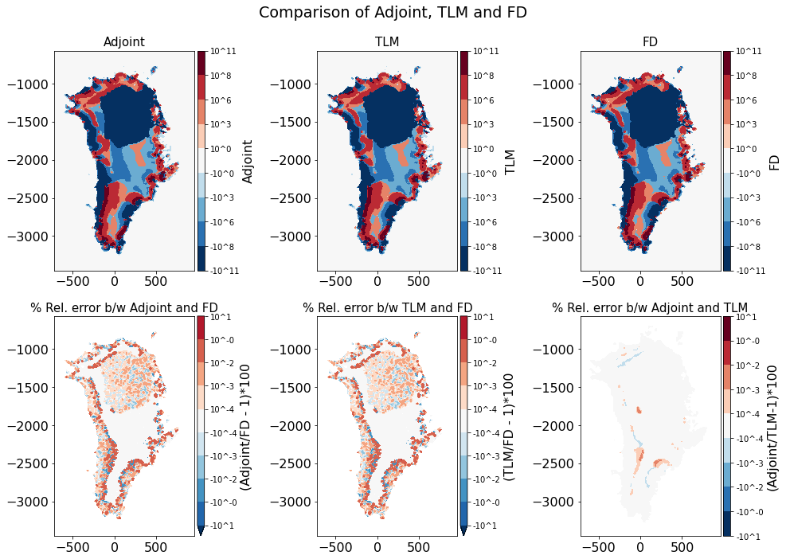

.. _ad_tutorial_validation:

Tutorial 3: Validating results of SICOPOLIS adjoint and tangent linear mode with Finite differences 
****************************************************************************************************

In this tutorial, we will discuss how results we get from the adjoint and tangent linear modes (TLM) can be validated with a Finite Differences (FD) run. we use the header file ``v5_grl16_bm5_ss25ka`` provided as a reference template in SICOPOLIS. We shorten, however, the total time to 100 years, to keep the computational cost of the tangent linear and finite differences code reasonable. Our objective or cost function is the total volume of the ice sheet at the end of the run (``fc``). The sensitivity is evaluated with respect to the geothermal heat flux, ``q_geo``, a 19,186-dimensional field.

There are two ways to accomplish this - using the Python utilities or manually performing all 3 runs separately. We will discuss only the first one here. The second one is easily accomplished as well - by compiling using the ``MakefileTapenade`` and adding I/O instructions as added by the Python scripts manually.

As prerequisites, ensure you have set up everything correctly as described in the Configuration section for both SICOPOLIS and Tapenade. 

.. _validation_py:

Validation using automated Python script
========================================

The python script automatically inserts I/O statements correctly where necessary for validation. All we need to do is provide the correct ``test_ad/inputs.json`` file. The file looks something like this -

* ``test_ad/inputs.json``

.. code-block:: json

   {
       "json": "inputs.json",
       "header": "v5_grl16_bm5_ss25ka",
       "domain": "grl",
       "dep_var": "fc",
       "ind_var": "q_geo",
       "perturbation": 0.001,
       "checkpoint": 4,
       "run": true,
       "dimension": 2,
       "z_co_ord": null
   }

::

    cd test_ad
    python tapenade_config.py -jsf inputs.json

That's it! Although, this will only run the FD and TLM at 5 select points for validation. Since the adjoint computes the full gradient in one run, this is not an issue with the adjoint. In order to run the FD and TLM on the entire grid, we need to modify ``test_ad/tapenade_config.py`` slightly. We modify the ``limited_or_block_or_full`` option in the call to the ``simulation`` function from ``limited`` to ``full``. This is what it should look like - 

.. code-block:: python

    simulation(mode = mode, header = args.header, domain = args.domain,
                      ind_var = args.ind_var, dep_var = args.dep_var,
                      limited_or_block_or_full = 'full',
                      ind_var_dim = args.dimension, ind_var_z_co_ord = args.z_co_ord,
                      perturbation = args.perturbation,
                      run_executable_auto = args.run,
                      output_vars = args.output_vars, output_iters = args.output_iters, output_dims = args.output_dims,
                      output_adj_vars = args.output_adj_vars, output_adj_iters = args.output_adj_iters, output_adj_dims = args.output_adj_dims,
                      ckp_status = ckp_status, ckp_num = args.checkpoint)

This run will generate the following files, which are used to plot the results below: ``src/GradientVals_q_geo_1.00E-03_repo_grl16_bm5_ss25ka_{limited_or_full}.dat``, ``src/ForwardVals_q_geo_repo_grl16_bm5_ss25ka_{limited_or_full}.dat``, ``src/AdjointVals_q_geob_repo_grl16_bm5_ss25ka.dat``.

Results
=======

The results are shown in the plot below. The table below shows a comparison of the time taken by various methods for gradient calculation to evaluate the gradient for a scalar objective function with respect to a 19,186-dimensional 2D field (16 km mesh) in a typical SICOPOLIS run. Model setup and I/O times are not included. The runs are performed on Intel Xeon CPU E5-2695 v3 nodes (2.30 GHz clock rate, 35.84 MB L3 cache, 63.3 GB memory), on the Sverdrup cluster.

.. list-table::    
   :widths: 50 50
   :header-rows: 1

   * - Gradient calculation method
     - Time (in seconds) for 16 km mesh
   * - Finite Differences
     - :math:`1.640 \times 10^5`
   * - Tangent Linear Model
     - :math:`9.793 \times 10^4`
   * - Adjoint Model
     - :math:`2.214 \times 10^1`
 

Validation exercise for Adjoint/Tangent Linear (TLM) modes using the Finite Differences (FD) results for the sensitivity of ``fc`` with respect to ``q_geo``. The upper row shows the sensitivities computed using the Adjoint, Tangent Linear mode, and Finite Differences respectively. The bottom run illustrates the relative error between (Adjoint, FD), (TLM, FD), and (Adjoint, TLM) respectively.

