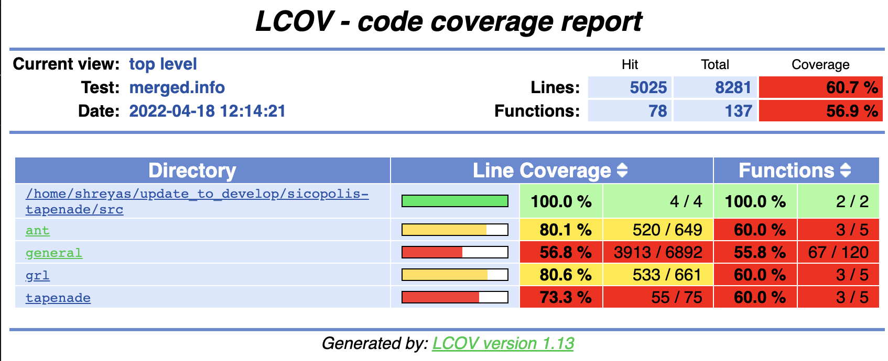

.. _ad_utilities:

Utilities
=========

Continuous Integration (CI)
---------------------------

We leverage the Continuous Integration (CI) infrastructure of Gitlab-CI. We have a suite of regression tests in our repository at ``test_ad/tests.py`` which leverage the ``pytest`` module in Python. The CI infrastructure allows us to automate the tests. Essentially, these tests are automatically triggered after new code is pushed to the remote repository. They run on an online ``gitlab runner`` which uses a virtual Docker environment that is correctly set up to run the SICOPOLIS code. The instructions that run in the Docker environment can be found in a file name ``.gitlab-ci.yml`` in the root directory. The status of tests can be seen with the help of the build badge in ``README.md`` in the ``ad`` branch.

Code coverage
-------------

The information in this section is based on the slides of `Dr. Karl Schulz <https://oden.utexas.edu/people/directory/Karl-W.-Schulz/>`__.

It is good practice to include the use of a code-coverage tool. Although it has not been used with Tapenade generated code, we can nonetheless use it with the original SICOPOLIS code to see what parts of this code are covered by our regression testing. We use the code coverage tool ``gcov`` and it's graphical front-end, ``lcov``. It aggregates gcov output to generate html containing the source code annotated with coverage information. More details can be found `here <https://gcc.gnu.org/onlinedocs/gcc/Gcov.html>`__ and `here <http://ltp.sourceforge.net/coverage/lcov.php>`__.

Let's say the user wants to generate the code coverage data from running two configurations, ``repo_grl20_ss25ka`` and ``repo_ant40_ss25ka``. Of course, since we only care about code coverage, the total time does not need to be 25000 years for the simulations. 100-200 years will work fine too.

First we generate the ``gcov`` output for ``repo_grl20_ss25ka``.

::

    % make -f MakefileTapenade clean; make -f MakefileTapenade drivergrdchk_cov HEADER=repo_grl20_ss25ka DOMAIN_SHORT=grl
    % ./drivergrdchk_cov 
    % make -f MakefileTapenade cov
    % lcov --capture --directory . --output-file coverage_repo_grl20_ss25ka.info

Next, we generate the ``gcov`` output for ``repo_ant40_ss25ka``.

::
    
    % make -f MakefileTapenade clean; make -f MakefileTapenade drivergrdchk_cov HEADER=repo_ant40_ss25ka DOMAIN_SHORT=ant
    % ./drivergrdchk_cov 
    % make -f MakefileTapenade cov
    % lcov --capture --directory . --output-file coverage_repo_ant40_ss25ka.info

Finally, we need to aggregate and visualize the results of the two ``info`` files we created. 

::

    % lcov --add-tracefile coverage_repo_grl20_ss25ka.info -a coverage_repo_ant40_ss25ka.info -o merged.info
    % genhtml merged.info --output-directory out

This will create a ``src/out`` directory. Open ``src/out/index.html`` to get your interactive, graphical output for code coverage.

You can click further on the hyperlinks to see individual files and lines.

   Example of graphical output for code coverage.

Automation using Python scripts
-------------------------------

``test_ad/tapenade_config.py`` contains a few helpful functions for automating the setup and I/O of desired variables in the finite differences, tangent linear and adjoint mode.
 
The Python functions get updated frequently, therfore the sections that follow are only supposed to serve as a basic guideline on what is possible using these scripts. With very little modifications, these scripts can be used to serve other purposes too.

Automated Normal Mode
^^^^^^^^^^^^^^^^^^^^^

To run the SICOPOLIS code normally (within the AD context, this is generally used to evaluate the cost function ``fc`` during calibration),

1. Remove the old output file that ``SICOPOLIS`` generates.

.. code-block:: python

   process = subprocess.run (['rm', '-r', f'../sico_out/N_{header}'])

2. Compile the code

.. code-block:: python

   compile_code(mode = 'normal', header = header, domain = domain,
                clean = True, dep_var=dep_var, ind_vars = ind_var)

3. Run the executable

.. code-block:: python

   run_executable('normal')

All of the above steps are bundled within the ``simulation`` function, which can be run as follows -

.. code-block:: python

   simulation(mode = 'normal', header = header, domain = domain,
                      run_executable_auto = True)

Automated Finite Differences
^^^^^^^^^^^^^^^^^^^^^^^^^^^^

A typical finite differences simulation requires perturbing the correct independent variable in the ``grdchk_main`` subroutine in ``src/subroutines/tapenade/tapenade_m.F90``. This is achieved as follows - 

1. Copy the correct header file to ``src/sico_specs.h``

.. code-block:: python

   copy_file(f'../headers/sico_specs_{header}.h', 'sico_specs.h')

2. Perturb the correct independent variable in ``grdchk_main`` subroutine in ``src/subroutines/tapenade/tapenade_m.F90``.

This step involves the following sub-steps:

   * Decide which of the three modes is most appropriate - ``limited, block, full``. ``limited`` means that we compute the finite differences sensitivity at 5 selected points only. ``block`` allows the sensitivity to be computed at a block of points within `block_imin, block_imax` and `block_jmin, block_jmax`. ``full`` computes the sensitivities for all points, which can be prohibitively expensive.

   * Copy the adjoint template file ``test_ad/tapenade_m_adjoint_template.F90`` to ``src/subroutines/tapenade/tapenade_m.F90``. This template file contains useful directives (these directives are comments to F90 compilers, but serve as reference strings to locate the correct line for our Python scripts) which the Python functions can leverage to perturb the correct independent variable in the right direction and compute the sensitivities, for example ``!@ python_automated_grdchk limited_or_block_or_full @`` ``!@ python_automated_grdchk @``. The following code snippet performs this task.

.. code-block:: python

   setup_grdchk(ind_var = ind_var, header = header, domain = domain,
	        dimension = ind_var_dim,
	        z_co_ord = ind_var_z_co_ord,
	        perturbation = perturbation,
	        limited_or_block_or_full = limited_or_block_or_full,
	        block_imin = block_imin, block_imax = block_imax, block_jmin = block_jmin, block_jmax = block_jmax,
	        tapenade_m_file = tapenade_m_file,
	        unit = unit)

3. Compile the code

.. code-block:: python
   
   compile_code(mode = 'grdchk', header = header, domain = domain,
	        clean = True, dep_var=dep_var, ind_vars = ind_var)

4. Run the executable

.. code-block:: python

   run_executable('grdchk')

All of the above steps are bundled within the ``simulation`` function, which can be run as follows - 

.. code-block:: python

   simulation(mode = 'grdchk', header = header, domain = domain, 
	              ind_var = ind_var, dep_var = dep_var,
		      limited_or_block_or_full = limited_or_block_or_full,
                      block_imin = block_imin, block_imax = block_imax, 
                      block_jmin = block_jmin, block_jmax = block_jmax,
		      ind_var_dim = dimension, ind_var_z_co_ord = z_co_ord,
		      perturbation = perturbation,
		      run_executable_auto = True)

Automated Tangent Linear Mode
^^^^^^^^^^^^^^^^^^^^^^^^^^^^^

A typical tangent linear mode simulation is set up by giving the correct dependent and independent variables to Tapenade, using the correct I/O for the differentiated variables, and compiling correctly. This can be done easily using the Python functions in ``test_ad/tapenade_config.py``.

1. Copy the correct header file to ``src/sico_specs.h``

.. code-block:: python

   copy_file(f'../headers/sico_specs_{header}.h', 'sico_specs.h')

2. Set up the I/O for the differentiated variable

This step involves the following sub-steps:

   * Decide which of the three modes is most appropriate - ``limited, block, full``. ``limited`` means that we compute the finite differences sensitivity at 5 selected points only. ``block`` allows the sensitivity to be computed at a block of points within `block_imin, block_imax` and `block_jmin, block_jmax`. ``full`` computes the sensitivities for all points, which can be prohibitively expensive.

   * Copy the TLM template file ``test_ad/tapenade_m_tlm_template.F90`` to ``src/subroutines/tapenade/tapenade_m.F90``. This template file contains useful directives (these directives are comments to F90 compilers, but serve as reference strings to locate the correct line for our Python scripts) which the Python functions can use to correctly set up the loop for getting the directional derivatives as well as the I/O, for example ``!@ python_automated_tlm dep_vard @`` ``!@ python_automated_tlm limited_or_block_or_full @``. The following code snippet performs this task.

.. code-block:: python

   setup_forward(ind_var = ind_var, header = header, domain = domain,
                 dimension = ind_var_dim,
    	         z_co_ord = ind_var_z_co_ord, limited_or_block_or_full = limited_or_block_or_full,
    	         block_imin = block_imin, block_imax = block_imax, 
                 block_jmin = block_jmin, block_jmax = block_jmax,
		 tapenade_m_file = tapenade_m_file,
		 unit = unit)

3. Compile the code.

.. code-block:: python

   compile_code(mode = 'forward', header = header, domain = domain,
                clean = True, dep_var=dep_var, ind_vars = ind_var)

4. Run the executable.

.. code-block:: python

   run_executable('forward')

All of the above steps are bundled within the ``simulation`` function, which can be run as follows -

.. code-block:: python

   simulation(mode = 'forward', header = header, domain = domain,
	              ind_var = ind_var, dep_var = dep_var,
		      limited_or_block_or_full = limited_or_block_or_full,
                      block_imin = block_imin, block_imax = block_imax, 
                      block_jmin = block_jmin, block_jmax = block_jmax,
		      ind_var_dim = dimension, ind_var_z_co_ord = z_co_ord,
		      run_executable_auto = True)

**NOTE**: While Tapenade can accept multiple independent variables at once, this automated script at least for now accepts only one independent variable at a time.

Automated Adjoint Mode
^^^^^^^^^^^^^^^^^^^^^^

The adjoint mode has the most possible options of what can be done with it. A typical adjoint simulation is set up by giving the correct dependent and independent variables to Tapenade, using the correct I/O for the differentiated variables, and compiling correctly. This can be done easily using the Python functions in ``test_ad/tapenade_config.py``. In addition, we can get the outputs of other adjoint variables, normal variables, both 2D and 3D at different time steps using the python script.

1. Set up checkpointing for the time loop, if necessary.

.. code-block:: python

   setup_binomial_checkpointing(status = True, number_of_steps = ckp_num) 

2. Copy the correct header file to ``src/sico_specs.h``

.. code-block:: python

   copy_file(f'../headers/sico_specs_{header}.h', 'sico_specs.h')

3. Compile the code once.

.. code-block:: python

	compile_code(mode = mode, header = header, domain = domain,
                clean = True, dep_var=dep_var, ind_vars = ind_var)	

4. Set up the I/O for the differentiated variable, as well as other variables the user might specify.

This step involves the following sub-steps:

   * Copy the adjoint template file ``test_ad/tapenade_m_adjoint_template.F90`` to ``src/subroutines/tapenade/tapenade_m.F90``. Set up I/O for the independent variable.

   * Modify ``src/sico_main_loop_m_cpp_b.f90`` to write the variables the user specifies to appropriate files at correct times.

     - **NOTE** - This implementation is a bit dependent on the strings in the differentiated code. For now, the Python script searches for certain strings in the differentiated code to decide where to add the I/O statements. Depending on configurations, these strings might not even be present in ``src/sico_main_loop_m_cpp_b.f90``, in which case the user would have to modify the script suitably after taking a look at ``src/sico_main_loop_m_cpp_b.f90``.

.. code-block:: python

	setup_adjoint(ind_vars = [ind_var], header = header, domain = domain, ckp_status = ckp_status,
	             numCore_cpp_b_file = numCore_cpp_b_file,
                     sico_main_loop_m_cpp_b_file = sico_main_loop_m_cpp_b_file,
	             dimensions = [ind_var_dim],
	             z_co_ords = [ind_var_z_co_ord],
	             output_vars = output_vars, output_iters = output_iters, output_dims = output_dims,
	             output_adj_vars = output_adj_vars, output_adj_iters = output_adj_iters, 
                     output_adj_dims = output_adj_dims)

Here, ``output_vars, output_iters, output_dims`` are user specified normal variables to be output to a file.
Similarly, ``output_adj_vars, output_adj_iters, output_adj_dims`` are user specified adjoint variables to be output to a file. 

5. Compile the code again. Note that the ``clean`` flag is set to False, since we want the changes we made to stay.

.. code-block:: python

		compile_code(mode = mode, header = header, domain = domain,
                clean = False, dep_var=dep_var, ind_vars = ind_var)

6. Run the executable - 

.. code-block:: python

   run_executable('adjoint')

All of the above steps are bundled within the ``simulation`` function, which can be run as follows -

.. code-block:: python

	simulation(mode = 'adjoint', header = header, domain = domain, 
              ind_var = ind_var, dep_var = dep_var,
	      ind_var_dim = dimension, ind_var_z_co_ord = z_co_ord,
	      run_executable_auto = True,
	      output_vars = output_vars, output_iters = output_iters, output_dims = output_dims,
	      output_adj_vars = output_adj_vars, output_adj_iters = output_adj_iters, 
              output_adj_dims = output_adj_dims, ckp_status = ckp_status, ckp_num = checkpoint)	

**NOTE**: While Tapenade can accept multiple independent variables at once, and this automated script accepts multiple independent variables too, we have only tested it with one independent variable at a time.

Input options
^^^^^^^^^^^^^

While executing the Python script the following input options are available to the users.

::
	
	"-jsf", "--json", help="name of json data file", type=str
	"-head", "--header", help="name of header file", type=str
	"-dom", "--domain", help="short name of domain, either grl or ant", type = str
	"-dv", "--dep_var", help="name of dependent variable", type=str
	"-iv", "--ind_var", help="name of independent variable", type=str
	"-delta", "--perturbation", help="value of perturbation for grdchk", type=float
	"-ckp", "--checkpoint", help="number of steps in checkpointing", type=int
	"--travis", help="travis setup", action="store_true"
	"-dim", "--dimension", help="2D or 3D independent variable, default 2D", type=int
	"-z", "--z_co_ord", help="z co-ordinate if 3D variable", type=int
	'-ov','--output_vars', nargs='+', help='List the fields you want to output'
	'-od', '--output_dims', nargs='+', help='List the z-coord of output vars, -1 if 2D'
	'-oi', '--output_iters', nargs='+', help='List the iter num of output vars, -1 if itercount_max'
	'-oav','--output_adj_vars', nargs='+', help='List the adjoint fields you want to output'
	'-oad', '--output_adj_dims', nargs='+', help='List the z-coord of adjoint output vars, -1 if 2D'
	'-oai', '--output_adj_iters', nargs='+', help='List the iter num of adjoint output vars, -1 if itercount_max'

Using all of these options on terminal can get cumbersome. Alternatively, one can use an input ``json`` file as explained below.

Reading inputs from a file
^^^^^^^^^^^^^^^^^^^^^^^^^^

We use the "header" files in the ``json`` format to provide inputs to ``test_ad/tapenade_config.py``. Note that this is an alternative to writing the entire python command on the terminal, which can get cumbersome and unwieldy. Note that one can also provide some options on terminal, and some in the ``inputs.json`` file. If an option is specified both on the terminal and in the json file, the value specified on the terminal takes precedence.

**Sample inputs.json file:**

A sample ``inputs.json`` file is provided here that acts as a "header" file for our AD workflow.

* ``test_ad/inputs.json``

.. code-block:: json

   {
       "json": "inputs.json",
       "header": "repo_grl20_ss25ka",
       "domain": "grl",
       "dep_var": "fc",
       "ind_var": "H",
       "perturbation": 0.001,
       "checkpoint": 4,
       "travis": false,
       "dimension": 2,
       "z_co_ord": null,
       "output_vars": ["H", "vx_c", "vy_c", "H", "vx_c", "vy_c", "H", "vx_c", "vy_c", "H", "vx_c", "vy_c"],
       "output_dims": [-1, 40, 40, -1, 40, 40, -1, 40, 40],
       "output_iters": ["-1", "-1", "-1", "1", "1", "1", "2", "2", "2"],
       "output_adj_vars": ["H", "H", "H", "vx_c", "vx_c", "vx_c", "vy_c", "vy_c", "vy_c"],
       "output_adj_dims": ["-1", "-1", "-1", "40", "40", "40", "40", "40", "40"],
       "output_adj_iters": ["1", "2", "-1", "1", "2", "-1", "1", "2", "-1"]
   }

Validation
^^^^^^^^^^

Validation of AD (``adjoint, forward``) with finite differences (``grdchk``) can be performed as follows (within the defined tolerance ``TOL``) -

.. code-block:: python

   validate_FD_AD(grdchk_file, ad_file, tolerance = TOL)
