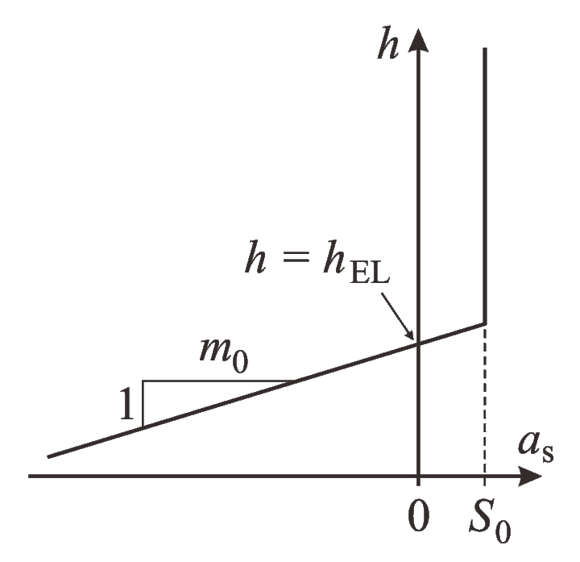

.. _clim_atm_forcing:

Atmospheric forcing
*******************

.. _atm_eismint:

EISMINT
=======

For the EISMINT (simplified geometry) domain, the surface mass balance (SMB) and surface temperature are specified by simple parameterizations. These parameterizations depend either on the distance from the centre of the domain, :math:`r`, or on the surface elevation, :math:`h`.

The distance-dependent parameterizations (parameter ``SURFACE_FORCING = 1``) are those from the original EISMINT set-up by Payne et al. :cite:`payne_etal_2000`. The SMB, :math:`a_\mathrm{s}`, is given by

.. math::
  :label: eq_emt_smb_param_1

  a_\mathrm{s} = \mathrm{min}[B_\mathrm{max},\,S_\mathrm{b}(R_\mathrm{EL}-r)],

where :math:`B_\mathrm{max}` is the maximum SMB, :math:`S_\mathrm{b}` the gradient of SMB change with horizontal distance and :math:`R_\mathrm{EL}` the distance of the equilibrium line from the centre of the domain. The surface temperature, :math:`T_\mathrm{s}`, is also made a function of :math:`r`,

.. math::
  :label: eq_emt_st_param_1

  T_\mathrm{s} = T_\mathrm{min} + S_\mathrm{T}\,r,

where :math:`T_\mathrm{min}` is the minimum temperature and :math:`S_\mathrm{T}` the gradient of surface-temperature change with distance.

In the run-specs headers, the parameters to be defined are

* ``B_MAX`` (:math:`=B_\mathrm{max}`, in m/a),
* ``S_B`` (:math:`=S_\mathrm{b}`, in m/(a*km)),
* ``ELD`` (:math:`=R_\mathrm{EL}`, in km),
* ``TEMP_MIN`` (:math:`=T_\mathrm{min}`, in degC),
* ``S_T`` (:math:`=S_\mathrm{T}`, in K/km).

The more realistic elevation-dependent parameterizations (``SURFACE_FORCING = 2``) are by Greve and Blatter :cite:`greve_blatter_2009` (their Section 5.7.4). The SMB, :math:`a_\mathrm{s}`, is given by

.. math::
  :label: eq_emt_smb_param_2

  a_\mathrm{s} = \mathrm{min}[S_0,\,m_0(h-h_\mathrm{EL})],

where :math:`S_0` is the snowfall rate, :math:`m_0` the melting gradient and :math:`h_\mathrm{EL}` the equilibrium-line altitude (:numref:`eismint_smb_param_2`). The surface temperature, :math:`T_\mathrm{s}`, follows the linear relationship

.. math::
  :label: eq_emt_st_param_2

  T_\mathrm{s} = T_\mathrm{sl} - \gamma h,

where :math:`T_\mathrm{sl}` is the surface temperature at elevation :math:`h=0` ("sea level") and :math:`\gamma` the atmospheric lapse rate.

.. _eismint_smb_param_2:

  Parameterization of the surface mass balance :math:`a_\mathrm{s}` as a function of the surface elevation :math:`h`. The three parameters are the snowfall rate :math:`S_0`, the melting gradient :math:`m_0` and the equilibrium line altitude :math:`h_\mathrm{EL}`.

In the run-specs headers, the parameters to be defined are

* ``S_0`` (:math:`=S_0`, in m/a),
* ``M_0`` (:math:`=m_0`, in m/(a*km)),
* ``ELA`` (:math:`=h_\mathrm{EL}`, in km),
* ``TEMP_0`` (:math:`=T_\mathrm{sl}`, in degC),
* ``GAMMA_T`` (:math:`=\gamma`, in K/km).

For both the distance- and elevation-dependent parameterizations, time-dependent anomalies of the surface temperature can be defined via the parameter ``TSURFACE`` and additional parameters as described in the run-specs headers.
