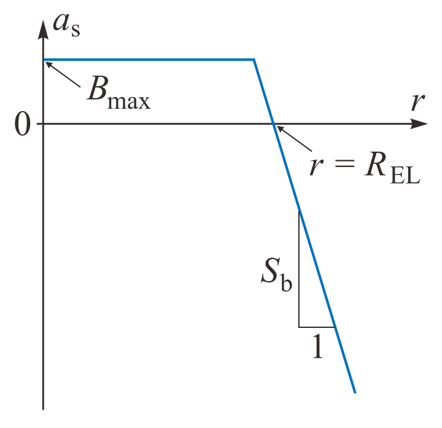
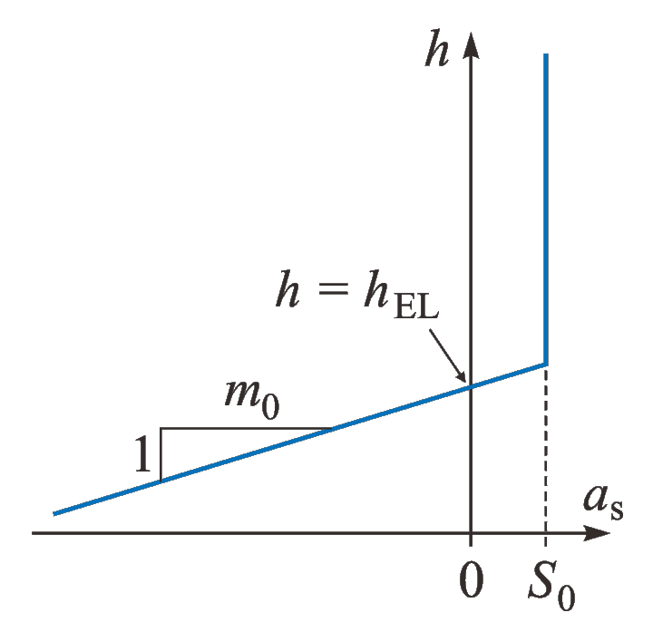

.. _clim_atm_forcing:

Atmospheric forcing
*******************

.. |nbsp| unicode:: 0xA0 
   :trim:

.. _atm_eismint:

EISMINT
=======

For the EISMINT (simplified geometry) domain, the surface temperature and surface mass balance (SMB) are specified by simple parameterizations. These parameterizations depend either on the horizontal distance from the centre of the domain, :math:`r`, or on the surface elevation, :math:`h`.

The distance-dependent parameterizations (parameter ``SURFACE_FORCING = 1``) are those from the original EISMINT set-up by Payne et al. :cite:`payne_etal_2000`. The surface temperature, :math:`T_\mathrm{s}`, is given by

.. math::
  :label: eq_emt_st_param_1

  T_\mathrm{s} = T_\mathrm{min} + S_\mathrm{T}\,r,

where :math:`T_\mathrm{min}` is the minimum temperature and :math:`S_\mathrm{T}` the gradient of surface-temperature change with distance. The SMB, :math:`a_\mathrm{s}`, is also made a function of :math:`r`,

.. math::
  :label: eq_emt_smb_param_1

  a_\mathrm{s} = \mathrm{min}[B_\mathrm{max},\,S_\mathrm{b}(R_\mathrm{EL}-r)],

where :math:`B_\mathrm{max}` is the maximum SMB, :math:`S_\mathrm{b}` the gradient of SMB change with horizontal distance and :math:`R_\mathrm{EL}` the distance of the equilibrium line from the centre of the domain (:numref:`eismint_smb_param_1`).

.. _eismint_smb_param_1:

  Parameterization of the SMB, :math:`a_\mathrm{s}`, as a function of the horizontal distance from the domain centre, :math:`r`. The three parameters are the maximum SMB, :math:`B_\mathrm{max}`, the gradient of SMB change with horizontal distance, :math:`S_\mathrm{b}`, and the equilibrium line distance, :math:`R_\mathrm{EL}`.

In the run-specs headers, the parameters to be defined are

* ``TEMP_MIN`` (:math:`=T_\mathrm{min}`, in degC),
* ``S_T`` (:math:`=S_\mathrm{T}`, in K/km),
* ``B_MAX`` (:math:`=B_\mathrm{max}`, in m/a),
* ``S_B`` (:math:`=S_\mathrm{b}`, in m/(a*km)),
* ``ELD`` (:math:`=R_\mathrm{EL}`, in km).

The more realistic elevation-dependent parameterizations (``SURFACE_FORCING = 2``) are by Greve and Blatter :cite:`greve_blatter_2009` (their Section 5.7.4). The surface temperature, :math:`T_\mathrm{s}`, follows the linear relationship

.. math::
  :label: eq_emt_st_param_2

  T_\mathrm{s} = T_\mathrm{sl} - \gamma h,

where :math:`T_\mathrm{sl}` is the surface temperature at elevation :math:`h=0` ("sea level") and :math:`\gamma` the atmospheric lapse rate. The SMB, :math:`a_\mathrm{s}`, is parameterized by

.. math::
  :label: eq_emt_smb_param_2

  a_\mathrm{s} = \mathrm{min}[S_0,\,m_0(h-h_\mathrm{EL})],

where :math:`S_0` is the snowfall rate, :math:`m_0` the melting gradient and :math:`h_\mathrm{EL}` the equilibrium-line altitude (:numref:`eismint_smb_param_2`). 

.. _eismint_smb_param_2:

  Parameterization of the SMB, :math:`a_\mathrm{s}`, as a function of the surface elevation, :math:`h`. The three parameters are the snowfall rate, :math:`S_0`, the melting gradient, :math:`m_0`, and the equilibrium line altitude, :math:`h_\mathrm{EL}`.

In the run-specs headers, the parameters to be defined are

* ``TEMP_0`` (:math:`=T_\mathrm{sl}`, in degC),
* ``GAMMA_T`` (:math:`=\gamma`, in K/km),
* ``S_0`` (:math:`=S_0`, in m/a),
* ``M_0`` (:math:`=m_0`, in m/(a*km)),
* ``ELA`` (:math:`=h_\mathrm{EL}`, in km).

Currently, it is not implemented to make the parameters of the above parameterizations time-dependent. (This feature can be added quite easily if need arises.) However, time-dependent anomalies of the surface temperature can be defined via the parameter ``TSURFACE`` and additional parameters, as described in the run-specs headers.

.. _atm_n_s_mars:

North and south polar caps of Mars
==================================

For the north and south polar caps of Mars, the surface temperature and SMB are provided by a set of parameterizations called the Mars Atmosphere-Ice Coupler MAIC-1.5. It is driven directly by the orbital parameters obliquity, eccentricity and solar longitude of perihelion, to be provided as time-dependent values in an input file specified by the parameter ``INSOL_MA_90N_FILE`` (north polar cap) or ``INSOL_MA_90S_FILE`` (south polar cap). Further required parameter settings are ``TSURFACE = 6`` and ``ACCSURFACE = 3``.

The surface temperature is parameterized by the Local Insolation Temperature (LIT) scheme, which uses a daily and latitude-dependent radiation balance and includes a treatment of the seasonal CO\ :sub:`2` cap (Greve et al. :cite:`greve_etal_2010`). The SMB is parameterized by a distance-dependent equilibrium-line approach similar to Eq. |nbsp| :eq:`eq_emt_smb_param_1` (Greve et al. :cite:`greve_etal_2004`, Greve and Mahajan :cite:`greve_mahajan_2005`). For details, see the references and the documentation in the run-specs headers.
