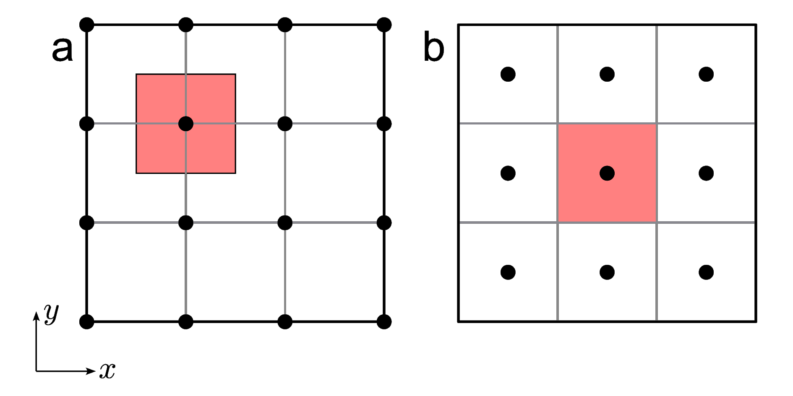
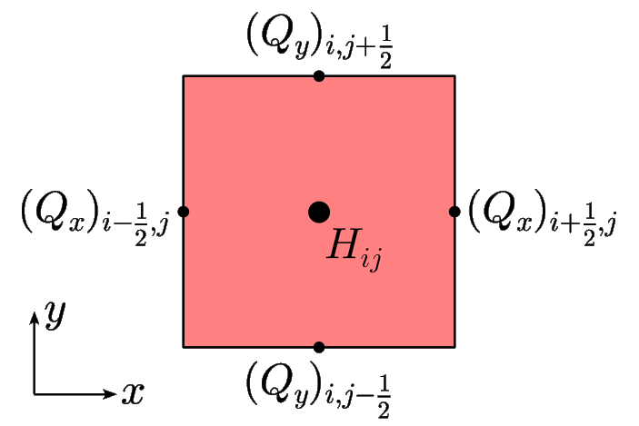

.. _domain_grid_time:

Model domain, grid and time
***************************

.. _model_domain:

Model domain
============

.. _defined_domain:

Selecting a pre-defined domain
------------------------------

SICOPOLIS provides several pre-defined model domains. They can be chosen by defining a domain code in the run-specs header as follows\:

.. code-block:: fortran

  #define GRL
  !             Simulated domain:
  !               ANT     - Antarctica
  !               GRL     - Greenland
  !               NHEM    - Entire northern hemisphere
  !               LCIS    - Laurentide and Cordilleran ice sheets
  !               SCAND   - Fennoscandian and Eurasian ice sheets
  !               TIBET   - Tibetan ice sheet
  !               ASF     - Austfonna
  !               NPI     - North Patagonian ice field
  !               MOCHO   - Mocho-Choshuenco ice cap
  !               EISMINT - EISMINT (Phase 2 SGE and modifications)
  !               HEINO   - ISMIP HEINO
  !               NMARS   - North polar cap of Mars
  !               SMARS   - South polar cap of Mars
  !               XYZ     - Unspecified domain

This example would select the domain for the Greenland ice sheet. Correspondingly for the other listed domains.

.. _new_domain:

Setting up a new domain
-----------------------

In addition to the pre-defined domains, there is an unspecified domain XYZ. This framework allows creating and testing new domains (e.g., some ice cap) quite easily. Create a run-specs header (by using an existing one as a template). Define the domain code as

.. code-block:: fortran

  #define XYZ

in the header. Input files (topography etc.) must be placed in ``sico_in/xyz`` and specified in the header as usual. With the parameter ``XYZ_SPECIAL_MODULES``, it can be selected whether common or special modules will be used\:

.. code-block:: fortran

  #define XYZ_SPECIAL_MODULES 0
  !               Only for unspecified domain XYZ:
  !                   0 : Common modules will be used
  !                   1 : Special modules 'boundary_m', 'sico_init_m'
  !                       and 'sico_vars_m' (in 'src/subroutines/xyz/')
  !                       will be used

In case of ``0`` (default), no further coding is required. In case of ``1``, the special modules ``boundary_m`` (climate forcing), ``sico_init_m`` (initializations) and ``sico_vars_m`` (additional global variables) must be created in ``src/subroutines/xyz/`` (by using existing ones as templates).

.. _spatial_grid:

Spatial grid
============

.. _spatial_grid_hor:

Horizontal coordinates
----------------------

In principle, SICOPOLIS allows using any orthogonal coordinates on the Earth's (or another planet's) surface, provided that the two components :math:`g_{11}` and :math:`g_{22}` of the metric tensor are known (see ":ref:`Orthogonal coordinates on the Earth's surface/General considerations <orthog_coord_gen>`"). Three options are currently implemented and can be selected in the run-specs header by the parameter ``GRID``\:

* ``0``: Cartesian coordinates in the stereographic plane without distortion correction.

* ``1``: Cartesian coordinates in the stereographic plane with distortion correction.

* ``2``: Geographic coordinates (longitude/latitude).

For the cases ``0`` and ``1``, a polar stereoraphic projection for an ellipsoidal planet model is employed. The projection parameters are defined in the run-specs header:

* ``PLANET_R`` (:math:`=R_\mathrm{e}`, mean radius of planet, in m),
* ``PLANET_A`` (:math:`=A`, semi-major axis of planet, in m),
* ``PLANET_F_INV`` (:math:`=F_\mathrm{inv}`, inverse flattening of planet),
* ``STEREO_PROJ_LATD0`` (:math:`=\varphi_0`, standard parallel, in deg, +/-- for N/S),
* ``STEREO_PROJ_LOND0`` (:math:`=\lambda_0`, central meridian, in deg, +/-- for E/W).

For case ``2`` (geographic coordinates), only the parameters ``R``, ``A`` and ``F_INV`` are relevant.

The semi-minor axis :math:`B` can be computed from the above parameters via :math:`B=A(1-1/F_\mathrm{inv})`. If :math:`F_\mathrm{inv}=\infty` (i.e., ``F_INV`` set to any finite value greater than ``1.0e+10_dp``), a spherical planet with radius :math:`R_\mathrm{e}` is assumed instead of an elliptical one.

The components :math:`g_{11}` and :math:`g_{22}` of the metric tensor are computed for simplicity under the assumption of a spherical planet. For case ``0`` (distortion correction neglected), they are set to unity. For the cases ``1`` and ``2``, the derivations are found in ":ref:`Orthogonal coordinates on the Earth's surface/Polar stereographic projection <orthog_coord_pol_ster>`" and ":ref:`Orthogonal coordinates on the Earth's surface/Geographic coordinate system <orthog_coord_geogr>`", respectively. The computations are carried out in the module ``metric_m``.

For the most common case of Cartesian coordinates :math:`x` and :math:`y` in the stereographic plane (or any other projection plane), let the domain be the rectangle described by :math:`[x_0,x_\mathrm{max}]`, :math:`[y_0,y_\mathrm{max}]`. It is discretized by a regular (structured) grid with horizontal resolution :math:`\Delta{x}`, which is the same for the :math:`x`- and :math:`y`-directions. SICOPOLIS employs grid-line registration (:numref:`grid_registration`). Hence, the location of the grid points (nodes) :math:`x_i` and :math:`y_j` is given by

.. math::
  :label: eq_discr_x

  x_i = x_0 + i\Delta{x}, \qquad i=0\,(1)\,i_\mathrm{max},

.. math::
  :label: eq_discr_y

  y_j = y_0 + j\Delta{x}, \qquad j=0\,(1)\,j_\mathrm{max},

where the notation :math:`a\,(b)\,c` means "from :math:`a` to :math:`c` in steps of :math:`b`". Note that the indices :math:`i` and :math:`j` run from 0, so that the number of grid points is actually :math:`i_\mathrm{max}+1` and :math:`j_\mathrm{max}+1`, respectively. In the run-specs headers, the parameters to be defined are

* ``X0`` (:math:`=x_0`, :math:`x` coordinate of the origin point in km),
* ``Y0`` (:math:`=y_0`, :math:`y` coordinate of the origin point in km),
* ``DX`` (:math:`=\Delta{}x`, horizontal grid spacing in km),
* ``IMAX`` (:math:`=i_\mathrm{max}`, maximum value of the index :math:`i`),
* ``JMAX`` (:math:`=j_\mathrm{max}`, maximum value of the index :math:`j`).

.. _grid_registration:

  Two grid registration types for a regular (structured) grid.
  (a) Grid-line registration:
  the nodes (solid circles) are located at the intersections of the grid lines.
  (b) Pixel registration:
  the nodes (solid circles) are centred in the areas between grid lines.
  The red shades indicate the footprints of the nodes
  (areas represented by the values at the nodes).
  SICOPOLIS employs grid-line registration (a).

.. _spatial_grid_vert:

Vertical coordinate
-------------------

For the vertical (:math:`z`) direction, a terrain-following ("sigma") transformation is employed that maps vertical columns in the physical space onto :math:`[0,1]` intervals. If the polythermal two-layer method (POLY, see Section ":ref:`ice_thermodynamics`") is employed, this mapping is done separately for the upper cold-ice layer (:math:`\zeta_\mathrm{c}` domain), the lower temperate-ice layer (:math:`\zeta_\mathrm{t}` domain) and the lithosphere layer (:math:`\zeta_\mathrm{r}` domain). The transformation is linear for the :math:`\zeta_\mathrm{t}` and :math:`\zeta_\mathrm{r}` domains. However, for the :math:`\zeta_\mathrm{c}` domain, exponential stretching is used so that equidistant grid points in the transformed domain map on grid points concentrating towards the base in the physical :math:`z`-coordinate\:

.. math::
  :label: eq_sigma_trans_poly

  \frac{z-z_\mathrm{m}}{H_\mathrm{c}} = \frac{e^{a\zeta_\mathrm{c}}-1}{e^a-1},
  \qquad
  \frac{z-b}{H_\mathrm{t}} = \zeta_\mathrm{t},
  \qquad
  \frac{z-b_\mathrm{r}}{H_\mathrm{r}} = \zeta_\mathrm{r},

where the geometric quantities are explained in :numref:`poly_ice_sheet` and :math:`a` is the exponential stretch parameter for the :math:`\zeta_\mathrm{c}` domain. For this parameter, :math:`a=2` is a typical choice, while the limit :math:`a=0` produces a linear transformation.

.. _poly_ice_sheet:

  Cross section through a polythermal ice sheet (vertically exaggerated).

  | :math:`h`: position of the ice surface,
  | :math:`z_\mathrm{m}`: position of the CTS
  | (CTS: "cold-temperate transition surface", interface between the cold-ice and temperate-ice layers),
  | :math:`b`: position of the ice base,
  | :math:`b_\mathrm{r}`: position of the base of the lithosphere layer,
  | :math:`H=h-b`: ice thickness,
  | :math:`H_\mathrm{c}=h-z_\mathrm{m}`: thickness of the cold-ice layer,
  | :math:`H_\mathrm{t}=z_\mathrm{m}-b`: thickness of the temperate-ice layer, if existing (thus :math:`H=H_\mathrm{c}+H_\mathrm{t}`),
  | :math:`H_\mathrm{r}=b-b_\mathrm{r}`: thickness of the lithosphere (rock) layer.

The location of the grid points in the three transformed domains is given by

.. math::
  :label: eq_discr_zc

  (\zeta_\mathrm{c})_{k_\mathrm{c}} = k_\mathrm{c}/k_\mathrm{c,max},
  \qquad k_\mathrm{c}=0\,(1)\,k_\mathrm{c,max},

.. math::
  :label: eq_discr_zt

  (\zeta_\mathrm{t})_{k_\mathrm{t}} = k_\mathrm{t}/k_\mathrm{t,max},
  \qquad k_\mathrm{t}=0\,(1)\,k_\mathrm{t,max},

.. math::
  :label: eq_discr_zr

  (\zeta_\mathrm{r})_{k_\mathrm{r}} = k_\mathrm{r}/k_\mathrm{r,max},
  \qquad k_\mathrm{r}=0\,(1)\,k_\mathrm{r,max}.

The numbers of grid points result as :math:`k_\mathrm{c,max}+1`, :math:`k_\mathrm{t,max}+1` and :math:`k_\mathrm{r,max}+1`, respectively. The parameters in the run-specs headers are

* ``KCMAX`` (:math:`=k_\mathrm{c,max}`, maximum value of the index :math:`k_\mathrm{c}`),
* ``KTMAX`` (:math:`=k_\mathrm{t,max}`, maximum value of the index :math:`k_\mathrm{t}`),
* ``KRMAX`` (:math:`=k_\mathrm{r,max}`, maximum value of the index :math:`k_\mathrm{r}`),
* ``DEFORM`` (:math:`=a`, exponential stretch parameter for the :math:`\zeta_\mathrm{c}` domain).

For all other thermodynamics schemes (ENTC, ENTM, COLD, ISOT; see Section ":ref:`ice_thermodynamics`"), the entire ice column (no matter whether cold or temperate) is mapped on the :math:`\zeta_\mathrm{c}` domain. The :math:`\zeta_\mathrm{t}` domain is then redundant and collapses onto the ice base:

.. math::
  :label: eq_sigma_trans_enth

  \frac{z-b}{H} = \frac{e^{a\zeta_\mathrm{c}}-1}{e^a-1},
  \qquad
  b = \zeta_\mathrm{t},
  \qquad
  \frac{z-b_\mathrm{r}}{H_\mathrm{r}} = \zeta_\mathrm{r}.

For technical reasons, the :math:`\zeta_\mathrm{t}` domain is still present and should be assigned three grid points, that is, ``KTMAX`` should be set to ``2``.

.. _spatial_grid_stag:

Staggered grid
--------------

A staggered Arakawa C grid is used for reasons of numerical stability
(Arakawa and Lamb :cite:`arakawa_lamb_1977`). This means that the
components of the velocity (:math:`v_{x}`, :math:`v_{y}`,
:math:`v_{z}`) and the volume flux (depth-integrated horizontal
velocity; :math:`Q_{x}`, :math:`Q_{y}`) are defined in between the
grid points, while all other quantities are defined on the grid
points.

.. _arakawa_c_grid:

  Arakawa C grid for the ice thickness :math:`H` and the volume flux
  :math:`(Q_{x},Q_{y})` in one grid cell in the horizontal plane,
  centred around the grid point :math:`(i,j)`.

For the example of the 2D fields ice thickness and volume flux, this
is illustrated in :numref:`arakawa_c_grid`. For the 3D fields, the
principle is the same: The velocity components are defined in between
the grid points\:

.. math::
  :label: eq_arakawa_c_vxyz

  (v_{x})_{i\pm\frac{1}{2},j,k} \; ,
  \quad
  (v_{y})_{i,j\pm\frac{1}{2},k} \; ,
  \quad
  (v_{z})_{i,j,k\pm\frac{1}{2}} \; ,

while other fields like the temperature :math:`T` are defined on the
grid points\: :math:`T_{ijk}`. Note that, depending on the layer
(:math:`\zeta_\mathrm{c,t,r}` domains, see above), the index :math:`k`
can either be :math:`k_\mathrm{c}`, :math:`k_\mathrm{t}` or
:math:`k_\mathrm{r}`.

Since half-integer indices are not allowed in Fortran, they are
rounded down in the code. For the example of the velocity component
:math:`v_{x}` in the :math:`k_\mathrm{c}` domain\:

.. math::
  :label: eq_arakawa_c_indices

  (v_{x})_{i+\frac{1}{2},j,k_\mathrm{c}}
  \; \rightarrow \;
  \mbox{vx_c(kc,j,i)}\,,
  \quad
  (v_{x})_{i-\frac{1}{2},j,k_\mathrm{c}}
  \; \rightarrow \;
  \mbox{vx_c(kc,j,i-1)}\,.

.. _topography:

Topography
==========

Gridded present-day topographies that match the horizontal grid must be provided in either NetCDF (``*.nc``) or ASCII (any other file extension) format. They can be specified in the run-specs header as follows (example with NetCDF files for simulation ``repo_grl16_bm5_ss25ka``):

.. code-block:: fortran

  #define ZS_PRESENT_FILE   'grl_bm5_16_topo.nc'
  !                             Name of the file containing the present-day
  !                             ice-surface topography
  !                             (if NetCDF, variable name must be 'zs')

  #define ZB_PRESENT_FILE   'grl_bm5_16_topo.nc'
  !                             Name of the file containing the present-day
  !                             ice-base topography (only for ANF_DAT==1)
  !                             (if NetCDF, variable name must be 'zb')

  #define ZL_PRESENT_FILE   'grl_bm5_16_topo.nc'
  !                             Name of the file containing the present-day
  !                             lithosphere-surface topography
  !                             (only for ANF_DAT==1)
  !                             (if NetCDF, variable name must be 'zl')

  #define ZL0_FILE          'grl_bm5_16_zl0_llra.nc'
  !                             Name of the file containing the topography
  !                             of the relaxed lithosphere surface
  !                             (if NetCDF, variable name must be 'zl0')

  #define MASK_PRESENT_FILE 'grl_bm5_16_topo.nc'
  !                             Name of the file containing the present-day
  !                             ice-land-ocean mask
  !                             (if NetCDF, variable name must be 'mask')

  #define MASK_REGION_FILE 'none'
  !                             Name of the file containing the region mask
  !                             ('none' if no file is to be defined)
  !                             (if NetCDF, variable name must be 'mask_region')

.. _model_time:

Model time
==========

Model time runs from an initial time :math:`t_\mathrm{init}` until a final time :math:`t_\mathrm{final}`. For the numerical solution, this interval is discretized by different time steps:

* :math:`\Delta{}t`: dynamic time step, for computing velocity and topography,
* :math:`\Delta{}t_\mathrm{temp}`: thermodynamic time step, for computing temperature, water content and age, 
* :math:`\Delta{}t_\mathrm{wss}`: isostatic time step, for computing the isostatic steady-state displacement of the lithosphere (only if the elastic-lithosphere model is chosen).

The thermodynamic and isostatic time steps must be equal to or integer multiples of the dynamic time step. The values can be specified in the run-specs header as follows:

* ``TIME_INIT0`` (:math:`=t_\mathrm{init}`, initial time, in a),
* ``TIME_END0`` (:math:`=t_\mathrm{final}`, final time, in a),
* ``DTIME0`` (:math:`=\Delta{}t`, dynamic time step, in a),
* ``DTIME_TEMP0`` (:math:`=\Delta{}t_\mathrm{temp}`, thermodynamic time step, in a),
* ``DTIME_WSS0`` (:math:`=\Delta{}t_\mathrm{wss}`, isostatic time step, in a).

Further, there is a parameter ``YEAR_ZERO`` that specifies the SICOPOLIS year zero in astronomical year numbering [= signed year CE (AD)]. For instance, if set to ``1990``, the time count of SICOPOLIS will be relative to the calendar year 1990 CE. ``TIME_INIT0`` and ``TIME_END0`` must be given in this SICOPOLIS calendar.
