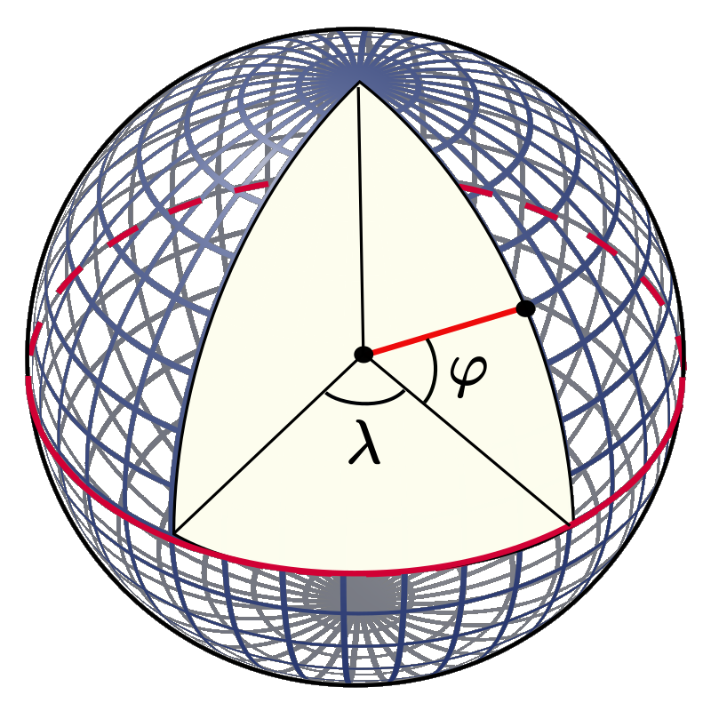

.. _orthog_coord:

Orthogonal coordinates on the Earth's surface
*********************************************

.. |nbsp| unicode:: 0xA0 
   :trim:

General considerations
======================

In what follows, the surface of the Earth will be regarded approximately as a sphere with radius :math:`R_\mathrm{e}=6371\,\mathrm{km}`. Be :math:`x^1`, :math:`x^2` the contravariant coordinates of an arbitrary orthogonal coordinate system on a subset of this sphere (for instance, the Greenland ice sheet and surrounding area). The covariant local base vectors, :math:`\mathbf{g}_1` and :math:`\mathbf{g}_2`, are then defined as the derivatives of the position vector, :math:`\mathbf{r}`, with respect to :math:`x^1`, :math:`x^2` (Bronshtein et al. :cite:`bronshtein_etal_2015`):

.. math::
  :label: orth_crd_eq001

  \mathbf{g}_i = \frac{\partial\mathbf{r}}{\partial{}x^i}.

The covariant metric tensor reads

.. math::
  :label: orth_crd_eq002

  (g_{ij})
    = (\mathbf{g}_i \cdot \mathbf{g}_j)
    = \left(\begin{array}{cc}{g_{11}}&{0}\\{0}&{g_{22}}\end{array}\right),

the non-diagonal elements vanishing because of the orthogonality assumption. Consequently, the contravariant metric tensor is

.. math::
  :label: orth_crd_eq003

  (g^{ij})
    = (g_{ij})^{-1}
    = \left(\begin{array}{cc}{1/g_{11}}&{0}\\{0}&{1/g_{22}}\end{array}\right).

The metric tensor determines the length of line elements :math:`\mathrm{d}s`:

.. math::
  :label: orth_crd_eq004

  \mathrm{d}s^2
     = \mathrm{d}\mathbf{r} \cdot \mathrm{d}\mathbf{r}
     = \frac{\partial\mathbf{r}}{\partial{}x^i} \mathrm{d}x^i
       \cdot \frac{\partial\mathbf{r}}{\partial{}x^j} \mathrm{d}x^j
     = g_{ij}\,\mathrm{d}x^i \mathrm{d}x^j.

A normalised set of base vectors, :math:`\mathbf{e}_1` and :math:`\mathbf{e}_2`, can be constructed as follows:

.. math::
  :label: orth_crd_eq005

  \mathbf{e}_i
  = \frac{\mathbf{g}_i}{\|\mathbf{g}_i\|}
  = \frac{\mathbf{g}_i}{\sqrt{\mathbf{g}_i\cdot\mathbf{g}_i}}
  = \frac{\mathbf{g}_i}{\sqrt{g_{ii}}}.

According to Bronshtein et al. :cite:`bronshtein_etal_2015`, the gradient of any scalar field :math:`f(x^1,x^2)` is

.. math::
  :label: orth_crd_eq006

  \mbox{grad}\,f = g^{ij} \frac{\partial{}f}{\partial{}x^i} \, \mathbf{g}_j,

and the divergence of any vector field :math:`\mathbf{u}(x^1,x^2)=u^1(x^1,x^2)\,\mathbf{g}_1+u^2(x^1,x^2)\,\mathbf{g}_2`
is

.. math::
  :label: orth_crd_eq007

  \mbox{div}\,\mathbf{u} = \frac{1}{\sqrt{g}} \, \frac{\partial{}(\sqrt{g}\,u^i)}{\partial{}x^i},

where :math:`g` denotes the determinant of :math:`(g_{ij})`,

.. math::
  :label: orth_crd_eq008

  g = g_{11}\,g_{22},

assumed to be positive.

In order to rewrite Eqs. |nbsp| :eq:`orth_crd_eq006`, :eq:`orth_crd_eq007` in physical components, the vectors :math:`\mbox{grad}\,f` and :math:`\mathbf{u}` must be expressed in the normalised base. With Eqs. |nbsp| :eq:`orth_crd_eq002`, :eq:`orth_crd_eq003` and :eq:`orth_crd_eq005`, Eq. |nbsp| :eq:`orth_crd_eq006` takes the form

.. math::
  :label: orth_crd_eq009

  \begin{eqnarray}
  \mbox{grad}\,f &=& g^{11} \sqrt{g_{11}} \,
                     \frac{\partial{}f}{\partial{}x^1} \, \mathbf{e}_1
                   + g^{22} \sqrt{g_{22}} \,
                     \frac{\partial{}f}{\partial{}x^2} \, \mathbf{e}_2
  \nonumber\\[1ex]
                 &=& \frac{1}{\sqrt{g_{11}}}
                     \frac{\partial{}f}{\partial{}x^1} \, \mathbf{e}_1
                   + \frac{1}{\sqrt{g_{22}}}
                     \frac{\partial{}f}{\partial{}x^2} \, \mathbf{e}_2.
  \end{eqnarray}

The physical components of :math:`\mathbf{u}` are defined by

.. math::
  :label: orth_crd_eq010

  \mathbf{u} = u^{\star 1}\,\mathbf{e}_1 + u^{\star 2}\,\mathbf{e}_2,

and thus, with Eq. |nbsp| :eq:`orth_crd_eq005`,

.. math::
  :label: orth_crd_eq011

  u^{\star i} = u^i\,\sqrt{g_{ii}}.

Inserting this result in Eq. |nbsp| :eq:`orth_crd_eq007` yields

.. math::
  :label: orth_crd_eq012

  \mbox{div}\,\mathbf{u}
   = \frac{1}{\sqrt{g_{11}\,g_{22}}}\,\left(
     \frac{\partial{}(\sqrt{g_{22}}\,u^{\star 1})}{\partial{}x^1}
     + \frac{\partial{}(\sqrt{g_{11}}\,u^{\star 2})}{\partial{}x^2} \right).

Equations |nbsp| :eq:`orth_crd_eq009` and :eq:`orth_crd_eq012` are useful for rewriting the model equations in any orthogonal coordinates on the Earth's surface.

Geographic coordinate system
============================

The geographic coordinate system for the surface of the Earth consists of the longitude :math:`\lambda` with range :math:`-180^\circ\ldots{}+180^\circ` (:math:`180^\circ\mathrm{W}\ldots{}180^\circ\mathrm{E}`) and the latitude :math:`\varphi` with range :math:`+90^\circ\ldots{}-90^\circ` (:math:`90^\circ\mathrm{N}\ldots{}90^\circ\mathrm{S}`) (:numref:`geogr_coord`).

.. _geogr_coord:

  Geographic coordinates :math:`\lambda` (longitude) and :math:`\varphi` (latitude) for a spherical Earth model. (Credit: Wikimedia Commons User:Peter Mercator, public domain.)

For the spherical Earth model employed here, a line element :math:`\mathrm{d}s` is expressed by

.. math::
  :label: orth_crd_eq013

  \mathrm{d}s^2 = R_\mathrm{e}^2 \cos^2\varphi\,\mathrm{d}\lambda^2
                + R_\mathrm{e}^2\,\mathrm{d}\varphi^2,

so that, with Eq. |nbsp| :eq:`orth_crd_eq004`,

.. math::
  :label: orth_crd_eq014

  g_{11} = R_\mathrm{e}^2 \cos^2\varphi,
  \quad
  g_{22} = R_\mathrm{e}^2.

The shortcoming of this system is that, when approaching the poles, :math:`\varphi=\pm 90^\circ`, the meridians (lines of constant longitude) converge, cumulating in a singularity at the poles themselves. Mathematically this becomes obvious when regarding the metric tensor:

.. math::
  :label: orth_crd_eq017

  \lim_{\varphi\rightarrow\pm 90^\circ} g_{11} = 0,

so that the expressions :eq:`orth_crd_eq009` and :eq:`orth_crd_eq012` are no longer defined. Therefore, the latitude-longitude system cannot be used unmodified for a domain that includes one of the Earth's poles.

Polar stereographic projection
==============================

In ice-sheet modelling, a popular alternative to geographic coordinates is the polar stereographic projection. It comes in two different versions for the northern and southern hemisphere, and maps the respective hemisphere to the stereographic plane, which is spanned by the latitude circle defined by the standard parallel :math:`\varphi_0` (:numref:`stereo_proj`).

.. _stereo_proj:

  Polar stereographic projection for (a) the northern and (b) the southern hemisphere. The stereographic plane is parallel to the equatorial plane and defined by the standard parallel :math:`\varphi_0`. A point :math:`P` on the surface of the Earth is projected on the point :math:`\mathrm{st}(P)` by intersecting the line :math:`PS` (case a) or :math:`PN` (case b) with the stereographic plane.

Northern hemisphere
-------------------

For the mapping of northern hemispheric regions (:math:`\varphi{}>0`), the polar stereographic projection takes the form

.. math::
  :label: orth_crd_eq018

  \begin{array}{rcl}
    x &=&  2R_\mathrm{e} K \tan\mbox{$\displaystyle\frac{\theta}{2}$}
                           \sin(\lambda-\lambda_0),
    \\[2ex]
    y &=& -2R_\mathrm{e} K \tan\mbox{$\displaystyle\frac{\theta}{2}$}
                           \cos(\lambda-\lambda_0),
  \end{array}

with the stretch coefficient

.. math::
  :label: orth_crd_eq019

  K = \cos^2\frac{\theta_0}{2}.

Further, :math:`\theta=90^\circ-\varphi` denotes the co-latitude with respect to the north pole, :math:`\theta_0=90^\circ-\varphi_0` is the standard parallel of the projection expressed in co-latitude, and :math:`\lambda_0` is the central meridian that defines the orientation of the Cartesian :math:`x`-:math:`y` system in the stereographic plane.

We now derive an expression for the line element :math:`\mathrm{d}s`. From Eq. |nbsp| :eq:`orth_crd_eq018`, with :math:`h(\theta):=\tan(\theta/2)`,

.. math::
  :label: orth_crd_eq021a

  \left(\begin{array}{c}{\mathrm{d}x}\\{\mathrm{d}y}\end{array}\right)
  = 2R_\mathrm{e} K
    \left(\begin{array}{cc}{h'(\theta)\sin(\lambda-\lambda_0)}&{h(\theta)\cos(\lambda-\lambda_0)}\\
                           {-h'(\theta)\cos(\lambda-\lambda_0)}&{h(\theta)\sin(\lambda-\lambda_0)}\end{array}\right)
    \left(\begin{array}{c}{\mathrm{d}\theta}\\{\mathrm{d}\lambda}\end{array}\right),

and hence,

.. math::
  :label: orth_crd_eq021b

  \left(\begin{array}{c}{\mathrm{d}\theta}\\{\mathrm{d}\lambda}\end{array}\right)
  = \frac{1}{2R_\mathrm{e} K \, h(\theta) h'(\theta)}
    \left(\begin{array}{cc}{h(\theta)\sin(\lambda-\lambda_0)}&{-h(\theta)\cos(\lambda-\lambda_0)}\\
                           {h'(\theta)\cos(\lambda-\lambda_0)}&{h'(\theta)\sin(\lambda-\lambda_0)}\end{array}\right)
    \left(\begin{array}{c}{\mathrm{d}x}\\{\mathrm{d}y}\end{array}\right).

With Eq. |nbsp| :eq:`orth_crd_eq013`, this yields

.. math::
  :label: orth_crd_eq022

  \begin{eqnarray}
  \mathrm{d}s^2 &=& R_\mathrm{e}^2\, (\mathrm{d}\theta^2 + \sin^2\theta\,\mathrm{d}\lambda^2)
  \nonumber\\
  &=& \frac{1}{4K^2 \, h^2(\theta) h^{\prime 2}(\theta)}
  \nonumber\\
  &&
  \times \left\{ \left( h^2(\theta) \sin^2(\lambda-\lambda_0)
         + h^{\prime 2}(\theta)
         \sin^2\theta\,\cos^2(\lambda-\lambda_0) \right)\,\mathrm{d}x^2
  \right.
  \nonumber\\
  && \quad
  + \left( h^2(\theta)
    \cos^2(\lambda-\lambda_0)
         + h^{\prime 2}(\theta)
           \sin^2\theta\,\sin^2(\lambda-\lambda_0) \right)\,\mathrm{d}y^2
  \nonumber\\
  && \quad \left.
  - \left( 2 [h^2(\theta) - \sin^2\theta\,
    h^{\prime 2}(\theta)]\,
         \sin(\lambda-\lambda_0)\cos(\lambda-\lambda_0) \right)\,\mathrm{d}x\,\mathrm{d}y
  \right\}.
  \end{eqnarray}

Since

.. math::
  :label: orth_crd_eq023

  h^2(\theta) - \sin^2\theta\, h^{\prime 2}(\theta)
  = \tan^2\frac{\theta}{2}
    - \frac{(2\sin\frac{\theta}{2}\cos\frac{\theta}{2})^2}
           {(2\cos^2\frac{\theta}{2})^2} = 0,

the contribution of the mixed term :math:`\propto \mathrm{d}x\,\mathrm{d}y` vanishes, which proves the orthogonality. With Eq. |nbsp| :eq:`orth_crd_eq023`, expression :eq:`orth_crd_eq022` reduces to

.. math::
  :label: orth_crd_eq024

  \mathrm{d}s^2
     = \frac{\mathrm{d}x^2 + \mathrm{d}y^2}{4K^2 \, h^{\prime 2}(\theta)}
     = \frac{\cos^4\frac{\theta}{2}}{K^2} (\mathrm{d}x^2 + \mathrm{d}y^2)
     = \frac{\mathrm{d}x^2 + \mathrm{d}y^2}{K^2 (1+\tan^2\frac{\theta}{2})^2}.

By applying transformation :eq:`orth_crd_eq018`, one may eliminate the co-latitude:

.. math::
  :label: orth_crd_eq025

  \mathrm{d}s^2
     = \frac{\mathrm{d}x^2 + \mathrm{d}y^2}{K^2
       \left(1+\frac{x^2+y^2}{(2R_\mathrm{e}K)^2}\right)^2},

from which the metric tensor of the projection can be inferred:

.. math::
  :label: orth_crd_eq026

  g_{11} = g_{22}
  = \frac{\cos^4\frac{\theta}{2}}{K^2}
  = \frac{1}{K^2 \left(1+\frac{x^2+y^2}{(2R_\mathrm{e}K)^2}\right)^2}.

A simpler alternative is to neglect the distortion involved by the projection. In this case, the metric tensor becomes equal to the identity tensor,

.. math::
  :label: orth_crd_eq020

  g_{11} = g_{22} = 1,

and the computation of gradients and divergences according to Eqs. |nbsp| :eq:`orth_crd_eq009` and :eq:`orth_crd_eq012` is straightforward.

Southern hemisphere
-------------------

For the southern hemispheric version (:math:`\varphi{}<0`) of the polar stereographic projection, we introduce the co-latitude with respect to the south pole, :math:`\tilde{\theta}=90^\circ+\varphi`, and write down :eq:`orth_crd_eq018` with :math:`\theta` replaced by :math:`\tilde{\theta}`,

.. math::
  :label: orth_crd_eq029

  \begin{array}{rcl}
    x &=& 2R_\mathrm{e} K \tan\frac{\tilde{\theta}}{2}
          \sin(\lambda-\lambda_0),
    \\[1ex]
    y &=& 2R_\mathrm{e} K \tan\frac{\tilde{\theta}}{2}
          \cos(\lambda-\lambda_0),
  \end{array}

where

.. math::
  :label: orth_crd_eq030

  K = \cos^2\frac{\tilde{\theta}_0}{2}

(:math:`\tilde{\theta}_0=90^\circ+\varphi_0`, standard parallel of the projection expressed in co-latitude). The minus sign in Eq. |nbsp| :eq:`orth_crd_eq018`\ :sub:`2` is omitted in Eq. |nbsp| :eq:`orth_crd_eq029`\ :sub:`2` to preserve a right-handed :math:`x`-:math:`y` system.

Except for the replacement :math:`\theta\rightarrow\tilde{\theta}`, the metric tensor of this projection is the same as that for the northern hemisphere (Eq. |nbsp| :eq:`orth_crd_eq026`). Again, one may choose for simplicity to neglect the distortion involved by the projection, and use the identity tensor (Eq. |nbsp| :eq:`orth_crd_eq020`) instead.
