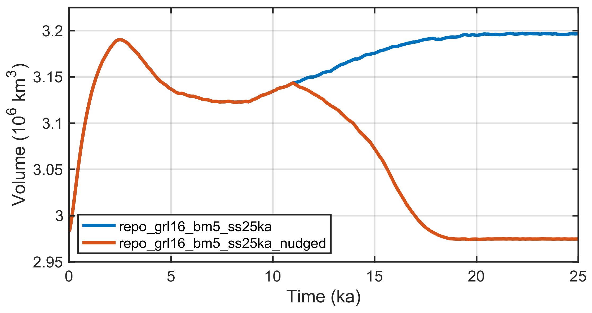
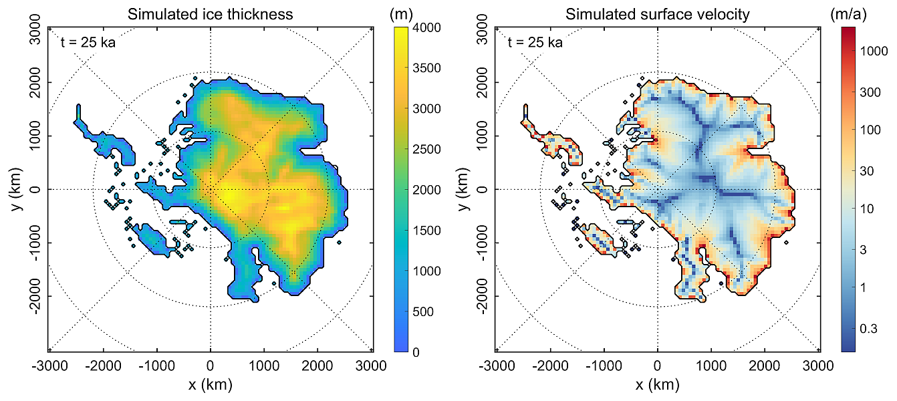
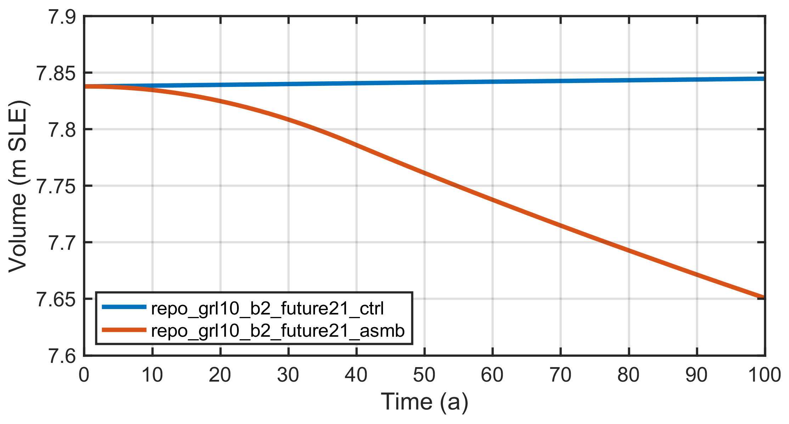
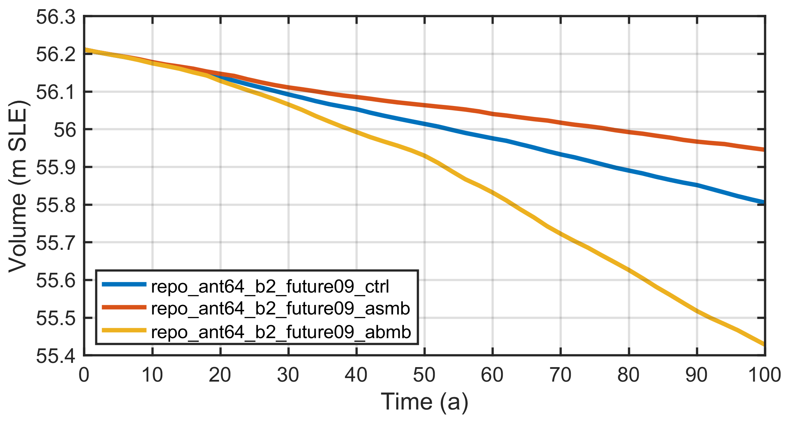

.. _test_simulations:

Test simulations
****************

.. |nbsp| unicode:: 0xA0 
   :trim:

These are a number of computationally rather inexpensive test simulations, of which the :ref:`run-specs header files <getting_started-run_specs_headers>` are contained in the SICOPOLIS repository.

Run ``repo_vialov3d25``
  | 3D version of the 2D Vialov profile (Vialov :cite:`vialov_1958`),
  | SIA, resolution 25 km, :math:`t=0\ldots{}100\,\mathrm{ka}`.
  | Similar to the EISMINT Phase 1 fixed-margin experiment (Huybrechts et al. :cite:`huybrechts_etal_1996`), but without thermodynamics. Instead, isothermal conditions with :math:`T=-10^{\circ}\mathrm{C}` everywhere are assumed.

Run ``repo_emtp2sge25_expA``
  | EISMINT Phase 2 Simplified Geometry Experiment A,
  | SIA, resolution 25 km, :math:`t=0\ldots{}200\,\mathrm{ka}` (Payne et al. :cite:`payne_etal_2000`).
  | The thermodynamics solver for this run is the one-layer melting-CTS enthalpy scheme (ENTM), while all other runs employ the polythermal two-layer scheme (POLY) (Greve and Blatter :cite:`greve_blatter_2016`).

Run ``repo_grl16_bm5_ss25ka``
  | Greenland ice sheet, SIA, resolution 16 km,
  | short steady-state run (:math:`t=0\ldots{}25\,\mathrm{ka}`) for modern climate conditions (:numref:`grl16_ss25ka_volume`; unpublished).

Runs ``repo_grl16_bm5_{init100a, ss25ka_nudged}``
  | Greenland ice sheet, SIA, resolution 16 km;
  | :math:`t=-100\,\mathrm{a}\ldots{}0` for the init run without basal sliding (..._init100a),
  | :math:`t=0\,\ldots{}25\,\mathrm{ka}` for the main run (..._ss25ka_nudged),
  | steady-state run for modern climate conditions, free evolution during the first 10 ka, after that gradual nudging towards the slightly smoothed present-day topography computed by the init run (:numref:`grl16_ss25ka_volume`; unpublished).

.. _grl16_ss25ka_volume:

  Ice volume for the two steady-state simulations for Greenland, repo_grl16_bm5_ss25ka (unconstrained evolution) and repo_grl16_bm5_ss25ka_nudged (topography nudging with time-dependent relaxation time after t |nbsp| = |nbsp| 10 |nbsp| ka).

Run ``repo_ant64_bm3_ss25ka``
  | Antarctic ice sheet, hybrid shallow-ice--shelfy-stream dynamics (Bernales et al. :cite:`bernales_etal_2017a`),
  | instantaneous removal of ice shelves ("float-kill"), resolution 64 km,
  | short steady-state run (:math:`t=0\ldots{}25\,\mathrm{ka}`) for modern climate conditions (:numref:`ant64_bm3_ss25ka0003_H_vs`; unpublished).

.. _ant64_bm3_ss25ka0003_H_vs:

  Ice thickness and surface velocity for the short steady-state simulation for Antarctica with instantaneous removal of ice shelves ("float-kill"), repo_ant64_bm3_ss25ka. The West Antarctic ice sheet has largely disappeared.

Run ``repo_grl20_b2_paleo21``
  | Greenland ice sheet, SIA, resolution 20 km,
  | :math:`t=-140\,\mathrm{ka}\ldots{}0`, basal sliding ramped up during the first 5 ka.
  | Modified, low-resolution version of the spin-up for ISMIP6 InitMIP (Greve et al. :cite:`greve_etal_2017a`).

Runs ``repo_grl10_b2_{paleo21, future21_ctrl, future21_asmb}``
  | Greenland ice sheet, SIA, resolution 10 km,
  | :math:`t=-9\,\mathrm{ka}\ldots{}0` for the paleo run, :math:`t=0\ldots{}100\,\mathrm{a}` for the two future runs.
  | 10-km version of the spin-up and schematic future climate runs for ISMIP6 InitMIP
  | (:numref:`grl10_b2_future21_vaf`; Greve et al. :cite:`greve_etal_2017a`, Seroussi et al. :cite:`seroussi_etal_2019`).

.. _grl10_b2_future21_vaf:

  Ice volume above flotation, expressed in metres of sea-level equivalent (m SLE), for the two ISMIP6 InitMIP future-climate simulations for Greenland, repo_grl10_b2_future21_ctrl (constant-climate control run) and repo_grl10_b2_future21_asmb (schematic surface-mass-balance anomaly applied).

Runs ``repo_ant64_b2_{spinup09_init100a, spinup09_fixtopo, spinup09, future09_ctrl, future09_asmb, future09_abmb}``
  | Antarctic ice sheet with hybrid shallow-ice--shelfy-stream dynamics
  | (Bernales et al. :cite:`bernales_etal_2017a`) and ice shelves (SSA), resolution 64 km;
  | :math:`t=-140.1\ldots{}-140\,\mathrm{ka}` for the init run without basal sliding (..._init100a),
  | :math:`t=-140\,\mathrm{ka}\ldots{}0` for the run with almost fixed topography (..._fixtopo), basal sliding ramped up during the first 5 ka,
  | :math:`t=-0.5\,\mathrm{ka}\ldots{}0` for the final, freely-evolving-topography part of the spin-up (..._spinup09),
  | :math:`t=0\ldots{}100\,\mathrm{a}` for the three future runs (..._future09_{ctrl, asmb, abmb}).
  | 64-km version of the spin-up and schematic future climate runs for ISMIP6 InitMIP
  | (:numref:`ant64_b2_future09_vaf`; Seroussi et al. :cite:`seroussi_etal_2019`).

.. _ant64_b2_future09_vaf:

  Ice volume above flotation, expressed in metres of sea-level equivalent (m SLE), for the three ISMIP6 InitMIP future-climate simulations for Antarctica, repo_ant64_b2_future09_ctrl (constant-climate control run), repo_ant64_b2_future09_asmb (schematic surface-mass-balance anomaly applied) and repo_ant64_b2_future09_abmb (schematic sub-ice-shelf-melt anomaly applied).

Runs ``repo_asf2_steady``, ``repo_asf2_surge``
  | Austfonna, SIA, resolution 2 km, :math:`t=0\ldots{}10\,\mathrm{ka}`.
  | Similar to Dunse et al. :cite:`dunse_etal_2011`'s Exp. 2 (steady fast flow) and Exp. 5 (surging-type flow), respectively.

Runs ``repo_nmars10_steady``, ``repo_smars10_steady``
  | North-/south-polar cap of Mars, SIA, resolution 10 km, :math:`t=-10\,\mathrm{Ma}\ldots{}0`.
  | Steady-state runs by Greve :cite:`greve_2007b`.
 
Run ``repo_nhem80_nt012_new``
  | Northern hemisphere, SIA, resolution 80 km, :math:`t=-250\,\mathrm{ka}\ldots{}0`.
  | Similar to run nt012 by Greve et al. :cite:`greve_etal_1999a`.

Run ``repo_heino50_st``
  | ISMIP HEINO standard run ST, SIA, resolution 50 km, :math:`t=0\ldots{}200\,\mathrm{ka}` (Calov et al. :cite:`calov_etal_2010`).

-------------

**Model times, time steps, computing times:**

+-------------------------------------+--------------------------+--------------------------------------+----------------------------+
| Run                                 | Model time               | Time step\ :sup:`†`                  | CPU time                   |
+=====================================+==========================+======================================+============================+
| repo\_vialov3d25                    | :math:`100\,\mathrm{ka}` | :math:`20\,\mathrm{a}`               | :math:`1.0\,\mathrm{min}`  |
+-------------------------------------+--------------------------+--------------------------------------+----------------------------+
| repo\_emtp2sge25\_expA              | :math:`200\,\mathrm{ka}` | :math:`20\,\mathrm{a}`               | :math:`4.7\,\mathrm{min}`  |
+-------------------------------------+--------------------------+--------------------------------------+----------------------------+
| repo\_grl16\_bm5\_ss25ka            | :math:`25\,\mathrm{ka}`  | :math:`5\,\mathrm{a}`                | :math:`10.9\,\mathrm{min}` |
+-------------------------------------+--------------------------+--------------------------------------+----------------------------+
| repo\_grl16\_bm5\_init100a          | :math:`100\,\mathrm{a}`  | :math:`5\,\mathrm{a}`                | :math:`1.6\,\mathrm{sec}`  |
+-------------------------------------+--------------------------+--------------------------------------+----------------------------+
| repo\_grl16\_bm5\_ss25ka_nudged     | :math:`25\,\mathrm{ka}`  | :math:`5\,\mathrm{a}`                | :math:`11.0\,\mathrm{min}` |
+-------------------------------------+--------------------------+--------------------------------------+----------------------------+
| repo\_ant64\_bm3\_ss25ka            | :math:`25\,\mathrm{ka}`  | :math:`2\,/\,10\,\mathrm{a}`         | :math:`8.9\,\mathrm{min}`  |
+-------------------------------------+--------------------------+--------------------------------------+----------------------------+
| repo\_grl20\_b2\_paleo21            | :math:`140\,\mathrm{ka}` | :math:`5\,\mathrm{a}`                | :math:`0.9\,\mathrm{hrs}`  |
+-------------------------------------+--------------------------+--------------------------------------+----------------------------+
| repo\_grl10\_b2\_paleo21\ :sup:`\*` | :math:`9\,\mathrm{ka}`   | :math:`1\,\mathrm{a}`                | :math:`1.1\,\mathrm{hrs}`  |
+-------------------------------------+--------------------------+--------------------------------------+----------------------------+
| repo\_grl10\_b2\_future21\_ctrl     | :math:`100\,\mathrm{a}`  | :math:`1\,\mathrm{a}`                | :math:`1.0\,\mathrm{min}`  |
+-------------------------------------+--------------------------+--------------------------------------+----------------------------+
| repo\_grl10\_b2\_future21\_asmb     | :math:`100\,\mathrm{a}`  | :math:`1\,\mathrm{a}`                | :math:`1.0\,\mathrm{min}`  |
+-------------------------------------+--------------------------+--------------------------------------+----------------------------+
| repo\_ant64\_b2\_spinup09\_init100a | :math:`100\,\mathrm{a}`  | :math:`2\,/\,10\,\mathrm{a}`         | :math:`4.3\,\mathrm{sec}`  |
+-------------------------------------+--------------------------+--------------------------------------+----------------------------+
| repo\_ant64\_b2\_spinup09\_fixtopo  | :math:`140\,\mathrm{ka}` | :math:`3.\bar{3}\,/\,10\,\mathrm{a}` | :math:`0.9\,\mathrm{hrs}`  |
+-------------------------------------+--------------------------+--------------------------------------+----------------------------+
| repo\_ant64\_b2\_spinup09           | :math:`500\,\mathrm{a}`  | :math:`1\,/\,5\,\mathrm{a}`          | :math:`0.7\,\mathrm{min}`  |
+-------------------------------------+--------------------------+--------------------------------------+----------------------------+
| repo\_ant64\_b2\_future09\_ctrl     | :math:`100\,\mathrm{a}`  | :math:`1\,/\,5\,\mathrm{a}`          | :math:`9.7\,\mathrm{sec}`  |
+-------------------------------------+--------------------------+--------------------------------------+----------------------------+
| repo\_ant64\_b2\_future09\_asmb     | :math:`100\,\mathrm{a}`  | :math:`1\,/\,5\,\mathrm{a}`          | :math:`9.7\,\mathrm{sec}`  |
+-------------------------------------+--------------------------+--------------------------------------+----------------------------+
| repo\_ant64\_b2\_future09\_abmb     | :math:`100\,\mathrm{a}`  | :math:`1\,/\,5\,\mathrm{a}`          | :math:`10.2\,\mathrm{sec}` |
+-------------------------------------+--------------------------+--------------------------------------+----------------------------+

| Table 1: Model times, time steps and computing (CPU) times for the EISMINT, Greenland and Antarctica test simulations contained in the script ``multi_sico_1.sh``, run with SICOPOLIS v24 (revision bdf61628b) and the Intel Fortran compiler 2021.8.0 for Linux (optimization options ``-xHOST -O3 -no-prec-div``) on a single core of a 12-Core Intel Xeon Gold 6256 (3.6 GHz) PC under openSUSE Leap 15.5.
| |nbsp| |nbsp| |nbsp| |nbsp| |nbsp| |nbsp| |nbsp| \ :sup:`†`: If one value is given, this is the common dynamic (velocity, ice thickness) and thermodynamic (temperature, water content, age) time step. If two values, separated by a slash (/), are given, the first one is the dynamic, the second one the thermodynamic time step.
| |nbsp| |nbsp| |nbsp| |nbsp| |nbsp| |nbsp| |nbsp| \ :sup:`\*`: For this run, see the remark in the :ref:`subsection on the resolution-doubler tool <plotting_and_tools-res_dbl>`.
